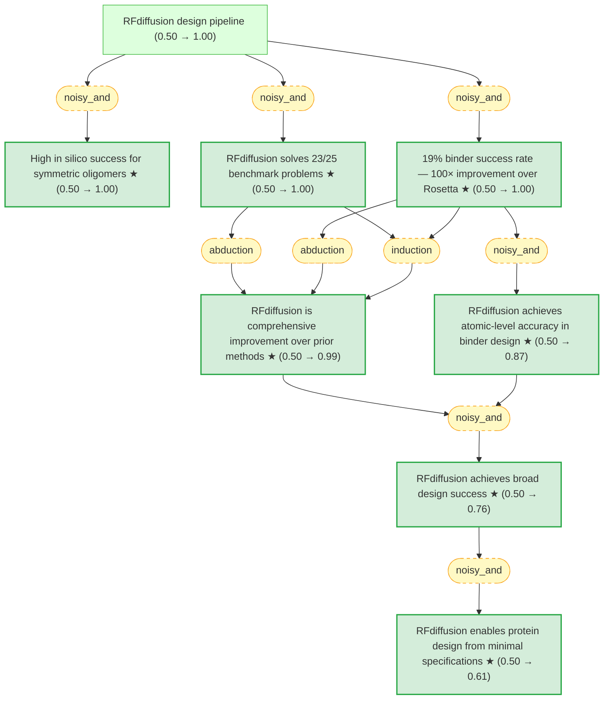

# watson-rfdiffusion-2023-gaia

Gaia knowledge package: Watson et al. 2023 — De novo design of protein structure and function with RFdiffusion (Nature)

 

## Overview

## Conclusions

| Label | Content | Belief |
|-------|---------|--------|
| binder_success_rate | The overall experimental success rate for RFdiffusion binders (binding at or ... | 1.00 |
| comprehensive_improvement | RFdiffusion is a comprehensive improvement over current protein design method... | 0.99 |
| generality_claim | In a manner analogous to networks that produce images from user-specified inp... | 0.61 |
| ha20_atomic_accuracy | The near-perfect agreement between the cryo-EM structure and the RFdiffusion ... | 0.87 |
| rfdiffusion_benchmark_performance | RFdiffusion solves 23 of the 25 benchmark motif-scaffolding problems, compare... | 1.00 |
| rfdiffusion_broad_success | RFdiffusion achieves outstanding performance on unconditional and topology-co... | 0.76 |
| symmetric_high_success | Despite not being trained on symmetric inputs, RFdiffusion generates symmetri... | 1.00 |

<!-- content:start -->
<!-- content:end -->
