# watson-rfdiffusion-2023-gaia

Gaia knowledge package: Watson et al. 2023 — De novo design of protein structure and function with RFdiffusion (Nature)

<!-- badges:start -->
<!-- badges:end -->

## Overview

> [!TIP]
> **Reasoning graph information gain: `3.4 bits`**
>
> Total mutual information between leaf premises and exported conclusions — measures how much the reasoning structure reduces uncertainty about the results.

```mermaid
---
config:
  flowchart:
    rankSpacing: 80
    nodeSpacing: 30
---
graph TB
    ddpm_properties_for_protein_design["DDPM properties suited for protein design\n(0.90 → 1.00)"]:::premise
    prior_ddpm_limitations["Limitations of prior protein diffusion methods\n(0.85 → 1.00)"]:::premise
    rf_inpainting_limitations["RFjoint Inpainting limitations\n(0.85 → 1.00)"]:::premise
    rfdiffusion_broad_success["★ RFdiffusion achieves broad design success\n(0.50 → 0.72)"]:::exported
    denoising_process["Iterative denoising generation process\n(0.92 → 1.00)"]:::premise
    self_conditioning_improvement["Self-conditioning improves RFdiffusion performance\n(0.88 → 1.00)"]:::premise
    pretraining_benefit["Pretraining from RF weights is critical\n(0.88 → 1.00)"]:::premise
    outperforms_hallucination["RFdiffusion outperforms RF Hallucination\n(0.92 → 1.00)"]:::premise
    symmetric_high_success["★ High in silico success for symmetric oligomers\n(0.50 → 1.00)"]:::exported
    sec_validation_oligomers["SEC validates oligomeric states\n(0.92 → 1.00)"]:::premise
    nsem_validates_cyclic["nsEM confirms cyclic oligomer structures\n(0.92 → 1.00)"]:::premise
    icosahedral_he0902["Icosahedral assembly HE0902 validated by nsEM\n(0.88 → 1.00)"]:::premise
    alt_coincidental_sec_profiles["Alternative: coincidental SEC profiles\n(0.30 → 0.30)"]:::premise
    alt_structural_mimicry_in_nsem["Alternative: structural mimicry in nsEM\n(0.12 → 0.12)"]:::premise
    alt_disordered_aggregates_mimicking_icosahedral["Alternative: disordered aggregates mimicking icosahedral symmetry\n(0.08 → 0.08)"]:::premise
    rfdiffusion_benchmark_performance["★ RFdiffusion solves 23/25 benchmark problems\n(0.50 → 1.00)"]:::exported
    hallucination_benchmark["Hallucination solves 15/25 benchmark problems\n(0.88 → 1.00)"]:::premise
    rf_inpainting_benchmark["RFjoint Inpainting solves 19/25 benchmark problems\n(0.88 → 1.00)"]:::premise
    noise_free_reverse["Noise-free reverse trajectories often improve success\n(0.88 → 1.00)"]:::premise
    motif_not_from_training["Scaffolding success independent of training set membership\n(0.88 → 1.00)"]:::premise
    p53_mdm2_design["p53-MDM2 binder scaffolding: 55/96 designs show binding\n(0.92 → 1.00)"]:::premise
    alt_nonspecific_binding_p53_mdm2["Alternative: non-specific binding in p53-MDM2 screens\n(0.18 → 0.18)"]:::premise
    alt_memorization["Alternative: training set memorization\n(0.15 → 0.15)"]:::premise
    alt_noise_free_overfitting["Alternative: noise-free improvement is overfitting\n(0.20 → 0.20)"]:::premise
    previous_binder_design_limitations["Prior binder design methods had low success rates\n(0.88 → 1.00)"]:::premise
    binder_success_rate["★ 19% binder success rate — 100× improvement over Rosetta\n(0.50 → 1.00)"]:::exported
    two_orders_attribution["Success rate improvement attributed to RFdiffusion + AF2 filtering\n(0.75 → 1.00)"]:::premise
    binder_specificity["IL-7Rα binders show site-specific binding\n(0.88 → 1.00)"]:::premise
    novel_interfaces["Novel binding interfaces distinct from PDB\n(0.88 → 1.00)"]:::premise
    ha20_cryoem_structure["Cryo-EM structure of HA_20-HA complex at 2.9 Å\n(0.95 → 0.95)"]:::premise
    ha20_atomic_accuracy["★ RFdiffusion achieves atomic-level accuracy in binder design\n(0.50 → 0.83)"]:::exported
    alt_copying_pdb_interfaces["Alternative: recapitulating PDB binding modes\n(0.15 → 0.15)"]:::premise
    alt_nonspecific_adhesion["Alternative: non-specific adhesion\n(0.18 → 0.18)"]:::premise
    alt_ha20_alternative_conformation["Alternative: HA_20 adopts alternative conformation\n(0.05 → 0.09)"]:::premise
    comprehensive_improvement["★ RFdiffusion is comprehensive improvement over prior methods\n(0.50 → 0.99)"]:::exported
    generality_claim["★ RFdiffusion enables protein design from minimal specifications\n(0.50 → 0.58)"]:::exported
    alt_outperforms_other_explanation["Alternative: benchmark artifact for unconditional generation\n(0.15 → 0.16)"]:::premise
    alt_benchmark_other_explanation["Alternative: easy benchmark set\n(0.20 → 0.21)"]:::premise
    alt_binder_other_explanation["Alternative: success due to AF2 filtering alone\n(0.25 → 0.26)"]:::premise
    strat_0(["infer\n0.68 bits"]):::weak
    alt_benchmark_other_explanation --> strat_0
    alt_binder_other_explanation --> strat_0
    alt_outperforms_other_explanation --> strat_0
    binder_success_rate --> strat_0
    outperforms_hallucination --> strat_0
    rfdiffusion_benchmark_performance --> strat_0
    strat_0 --> comprehensive_improvement
    strat_1(["infer\n0.05 bits"]):::weak
    alt_coincidental_sec_profiles --> strat_1
    alt_disordered_aggregates_mimicking_icosahedral --> strat_1
    alt_structural_mimicry_in_nsem --> strat_1
    ddpm_properties_for_protein_design --> strat_1
    denoising_process --> strat_1
    icosahedral_he0902 --> strat_1
    nsem_validates_cyclic --> strat_1
    pretraining_benefit --> strat_1
    prior_ddpm_limitations --> strat_1
    rf_inpainting_limitations --> strat_1
    sec_validation_oligomers --> strat_1
    self_conditioning_improvement --> strat_1
    strat_1 --> symmetric_high_success
    strat_2(["infer\n0.43 bits"]):::weak
    alt_copying_pdb_interfaces --> strat_2
    alt_nonspecific_adhesion --> strat_2
    binder_specificity --> strat_2
    ddpm_properties_for_protein_design --> strat_2
    denoising_process --> strat_2
    novel_interfaces --> strat_2
    pretraining_benefit --> strat_2
    previous_binder_design_limitations --> strat_2
    prior_ddpm_limitations --> strat_2
    rf_inpainting_limitations --> strat_2
    self_conditioning_improvement --> strat_2
    two_orders_attribution --> strat_2
    strat_2 --> binder_success_rate
    strat_3(["infer\n0.76 bits"]):::weak
    alt_ha20_alternative_conformation --> strat_3
    binder_success_rate --> strat_3
    ha20_cryoem_structure --> strat_3
    strat_3 --> ha20_atomic_accuracy
    strat_4(["infer\n0.25 bits"]):::weak
    alt_memorization --> strat_4
    alt_noise_free_overfitting --> strat_4
    alt_nonspecific_binding_p53_mdm2 --> strat_4
    ddpm_properties_for_protein_design --> strat_4
    denoising_process --> strat_4
    hallucination_benchmark --> strat_4
    motif_not_from_training --> strat_4
    noise_free_reverse --> strat_4
    p53_mdm2_design --> strat_4
    pretraining_benefit --> strat_4
    prior_ddpm_limitations --> strat_4
    rf_inpainting_benchmark --> strat_4
    rf_inpainting_limitations --> strat_4
    self_conditioning_improvement --> strat_4
    strat_4 --> rfdiffusion_benchmark_performance
    strat_5(["infer\n0.61 bits"]):::weak
    comprehensive_improvement --> strat_5
    ha20_atomic_accuracy --> strat_5
    strat_5 --> rfdiffusion_broad_success
    strat_6(["infer\n0.60 bits"]):::weak
    rfdiffusion_broad_success --> strat_6
    strat_6 --> generality_claim

    classDef premise fill:#ddeeff,stroke:#4488bb,color:#333
    classDef exported fill:#d4edda,stroke:#28a745,stroke-width:2px,color:#333
    classDef weak fill:#fff9c4,stroke:#f9a825,stroke-dasharray: 5 5,color:#333
    classDef contra fill:#ffebee,stroke:#c62828,color:#333
```

## Conclusions

| Label | Content | Prior | Belief |
|-------|---------|-------|--------|
| binder_success_rate | The overall experimental success rate for RFdiffusion binders (binding at or ... | 0.50 | 1.00 |
| comprehensive_improvement | RFdiffusion is a comprehensive improvement over current protein design method... | 0.50 | 0.99 |
| generality_claim | In a manner analogous to networks that produce images from user-specified inp... | 0.50 | 0.58 |
| ha20_atomic_accuracy | The near-perfect agreement between the cryo-EM structure and the RFdiffusion ... | 0.50 | 0.83 |
| rfdiffusion_benchmark_performance | RFdiffusion solves 23 of the 25 benchmark motif-scaffolding problems, compare... | 0.50 | 1.00 |
| rfdiffusion_broad_success | RFdiffusion achieves outstanding performance on unconditional and topology-co... | 0.50 | 0.72 |
| symmetric_high_success | Despite not being trained on symmetric inputs, RFdiffusion generates symmetri... | 0.50 | 1.00 |

<!-- content:start -->
<!-- content:end -->
