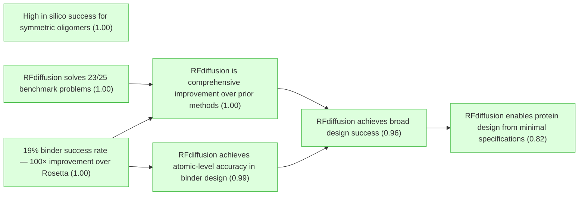
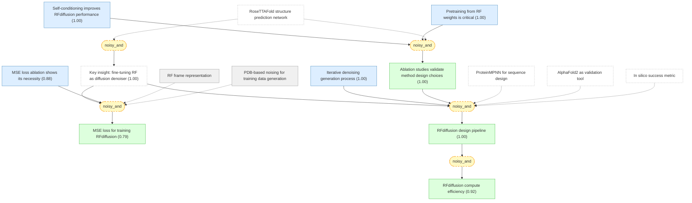
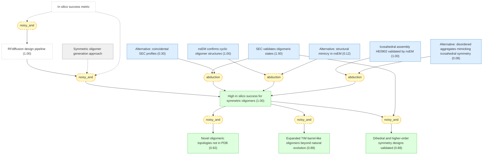

# watson-rfdiffusion-2023-gaia

Gaia knowledge package: Watson et al. 2023 — De novo design of protein structure and function with RFdiffusion (Nature)

## Overview

## Introduction and Motivation — Why RFdiffusion and what it promises.

#### Definition of DDPMs

📋 `ddpm_definition`

> Denoising diffusion probabilistic models (DDPMs) are a class of generative machine learning models that learn to reverse a gradual noising process. They are trained to denoise data (images, text, protein structures) corrupted with Gaussian noise, and by stochastically reversing this corruption, they generate diverse outputs resembling the training data.

#### RoseTTAFold structure prediction network

📋 `rosettafold_definition`

> RoseTTAFold (RF) is a protein structure prediction network that generates protein structures with high precision, operates on a rigid-frame representation of residues (Cα coordinate and N-Cα-C orientation per residue) with rotational equivariance, and has an architecture enabling conditioning on design specifications at the individual residue, inter-residue distance and orientation, and 3D coordinate levels.

#### AlphaFold2 as validation tool

📋 `alphafold2_definition`

> AlphaFold2 (AF2) is a highly accurate protein structure prediction method that predicts 3D protein structures from amino acid sequences. In this work, AF2 is used as an independent validation tool: a design is considered an in silico 'success' if AF2 predicts its structure with high confidence.

#### ProteinMPNN for sequence design

📋 `proteinmpnn_definition`

> ProteinMPNN is a deep learning network for protein sequence design. Given a protein backbone structure, it designs amino acid sequences that encode that structure. In the RFdiffusion pipeline, ProteinMPNN is used to design sequences for the backbone structures generated by RFdiffusion, typically sampling eight sequences per design.

#### Goal of de novo protein design

📋 `protein_design_goal`

> De novo protein design seeks to generate proteins with specified structural and/or functional properties, for example, making a binding interaction with a given target, folding into a particular topology, or containing a catalytic site.

#### In silico success metric

📋 `in_silico_success_definition`

> In silico 'success' is defined as an RFdiffusion output for which the AF2 structure predicted from a single sequence satisfies three criteria: (1) high confidence (mean predicted aligned error, pAE, less than 5), (2) globally within 2 Å backbone root mean-squared deviation (r.m.s.d.) of the designed structure, and (3) within 1 Å backbone r.m.s.d. on any scaffolded functional site. This measure correlates with experimental success and is more stringent than TM-score-based metrics.

#### DDPM properties suited for protein design

📌 `ddpm_properties_for_protein_design`   |   Prior: 0.90   |   Belief: **1.00**

> DDPMs have three properties well suited to protein design: (1) they generate highly diverse outputs because each denoising trajectory starts from different noise and follows a stochastic path; (2) they can be guided at each step towards specific design objectives through conditioning information; (3) rotationally equivariant DDPMs can model 3D protein structures in a global reference frame independent manner.

#### Limitations of prior protein diffusion methods

📌 `prior_ddpm_limitations`   |   Prior: 0.85   |   Belief: **1.00**

> Previous attempts to adapt DDPMs for protein monomer design (by conditioning on small protein 'motifs' or on secondary structure and block-adjacency information) showed limited success in generating sequences that fold to intended structures in silico, probably due to the limited ability of the denoising networks to generate realistic protein backbones, and were not tested experimentally.

#### RFjoint Inpainting limitations

📌 `rf_inpainting_limitations`   |   Prior: 0.85   |   Belief: **1.00**

> RFjoint Inpainting, a method that fine-tuned RoseTTAFold to complete protein backbones around input functional motifs in a single step, demonstrated that the method can scaffold a wide range of protein functional motifs with atomic accuracy. However, RFjoint Inpainting fails on minimalist site descriptions that do not sufficiently constrain the overall fold and, because it is deterministic, can produce only a limited diversity of designs for a given problem.

#### Key insight: fine-tuning RF as diffusion denoiser

📌 `key_insight`   |   Prior: 0.85   |   Belief: **1.00**

> By fine-tuning the RoseTTAFold structure prediction network on protein structure denoising tasks — rather than using it deterministically — a generative diffusion model can be obtained that overcomes the limitations of both prior DDPMs (poor backbone quality) and RFjoint Inpainting (limited diversity, failure on minimal specifications). Because the starting point is random noise, each denoising trajectory yields a different solution, and because structure is built up progressively through many denoising iterations, little to no starting structural information is required.

🔗 **noisy_and**([DDPM properties suited for protein design](#ddpm_properties_for_protein_design), [Limitations of prior protein diffusion methods](#prior_ddpm_limitations), [RFjoint Inpainting limitations](#rf_inpainting_limitations))

Reasoning

The authors reasoned that improved diffusion models for protein design could be developed by leveraging the deep understanding of protein structure implicit in structure prediction networks. @ddpm_properties_for_protein_design establishes that DDPMs have desirable properties for protein design (diversity, conditionability, equivariance). @prior_ddpm_limitations shows that previous protein DDPMs failed because their denoising networks could not generate realistic backbones. @rf_inpainting_limitations shows that while RF-based single-step inpainting worked, it was deterministic (limited diversity) and required substantial starting information. Combining DDPMs' stochastic iterative generation with RF's understanding of protein structure addresses both limitations: each trajectory from random noise yields a different solution (overcoming determinism), and iterative denoising progressively builds structure (overcoming the need for starting information).

#### RFdiffusion achieves broad design success ★

📌 `rfdiffusion_broad_success`   |   Prior: 0.75   |   Belief: **0.96**

> RFdiffusion achieves outstanding performance on unconditional and topology-constrained protein monomer design, protein binder design, symmetric oligomer design, enzyme active site scaffolding, and symmetric motif scaffolding for therapeutic and metal-binding protein design.

🔗 **noisy_and**([RFdiffusion is comprehensive improvement over prior methods](#comprehensive_improvement), [RFdiffusion achieves atomic-level accuracy in binder design](#ha20_atomic_accuracy))

Reasoning

@comprehensive_improvement establishes performance superiority across all application areas. @ha20_atomic_accuracy provides atomic-level structural proof (0.63 Å cryo-EM). Together these establish outstanding performance across all tested design tasks.

## Technical Approach — How RFdiffusion works: noising, denoising, training strategies.

#### PDB-based noising for training data generation

📋 `pdb_training_data`

> RFdiffusion training inputs are generated by noising protein structures sampled from the Protein Data Bank (PDB) for up to 200 steps. For translations, Cα coordinates are perturbed with 3D Gaussian noise. For residue orientations, Brownian motion on the manifold of rotation matrices is used.

#### RF frame representation

📋 `frame_representation`

> RFdiffusion uses the RoseTTAFold frame representation comprising a Cα coordinate and N-Cα-C rigid orientation for each residue. This representation is rotationally equivariant.

#### MSE loss for training RFdiffusion

📌 `mse_loss_design`   |   Belief: **0.79**

> RFdiffusion is trained by minimizing a mean-squared error (m.s.e.) loss between frame predictions and the true protein structure (without alignment), averaged across all residues. Unlike the FAPE loss used in RF structure prediction training, m.s.e. loss is not invariant to the global reference frame and therefore promotes continuity of the global coordinate frame between timesteps. The m.s.e. loss is crucial for unconditional generation.

🔗 **noisy_and**([Key insight: fine-tuning RF as diffusion denoiser](#key_insight), [MSE loss ablation shows its necessity](#mse_vs_fape_ablation))

Reasoning

The choice of m.s.e. loss follows from @key_insight that RF should be fine-tuned as a diffusion denoiser. Unlike FAPE loss (which is invariant to global reference frame), m.s.e. loss preserves global coordinate frame continuity between timesteps, which is essential for the iterative denoising process. @mse_vs_fape_ablation provides direct empirical confirmation: switching to FAPE notably decreases unconditional generation performance.

#### Iterative denoising generation process

📌 `denoising_process`   |   Prior: 0.92   |   Belief: **1.00**

> To generate a new protein backbone, RFdiffusion first initializes random residue frames, makes a denoised prediction, and updates each residue frame by taking a step in the direction of this prediction with some noise added. The reverse step size and noise are chosen so the denoising process matches the distribution of the noising process. Through many such steps (typically 200), random frames converge on realistic protein backbone structures.

#### Self-conditioning improves RFdiffusion performance

📌 `self_conditioning_improvement`   |   Prior: 0.88   |   Belief: **1.00**

> Self-conditioning — in which the model conditions on its previous prediction between timesteps, inspired by 'recycling' in AlphaFold2 — notably improved performance on in silico benchmarks encompassing both conditional and unconditional protein design tasks. Increased coherence of predictions within self-conditioned trajectories may at least in part explain these performance increases.

#### Pretraining from RF weights is critical

📌 `pretraining_benefit`   |   Prior: 0.88   |   Belief: **1.00**

> Fine-tuning RFdiffusion from pretrained RoseTTAFold weights was far more successful than training for an equivalent length of time from untrained (randomly initialized) weights, as measured by in silico success rates on unconditional generation benchmarks.

#### MSE loss ablation shows its necessity

📌 `mse_vs_fape_ablation`   |   Prior: 0.88   |   Belief: **0.88**

> Ablating the m.s.e. loss by training with FAPE loss instead notably decreases the performance of RFdiffusion for unconditional generation of 300 amino acid proteins, confirming that m.s.e. loss is essential.

#### RFdiffusion design pipeline

📌 `pipeline_description`   |   Prior: 0.90   |   Belief: **1.00**

> The RFdiffusion design pipeline consists of: (1) RFdiffusion generates a protein backbone structure via iterative denoising, (2) ProteinMPNN designs amino acid sequences for the backbone (typically 8 sequences per design), (3) AF2 predicts the structure from each designed sequence for validation. The pipeline can be conditioned on various inputs including partial sequence, fold information, symmetry specifications, or fixed functional-motif coordinates.

🔗 **noisy_and**([Key insight: fine-tuning RF as diffusion denoiser](#key_insight), [Iterative denoising generation process](#denoising_process), [Ablation studies validate method design choices](#method_design_validated))

Reasoning

The three-stage pipeline follows from: @key_insight establishes that RF fine-tuned as a denoiser generates backbone structures; @denoising_process describes the iterative denoising mechanism; @method_design_validated confirms the training recipe (self-conditioning + pretrained weights) is essential. ProteinMPNN then designs sequences for the generated backbones, and AF2 validates them.

#### RFdiffusion compute efficiency

📌 `compute_efficiency`   |   Belief: **0.92**

> RFdiffusion generation is more compute efficient than unconstrained Hallucination with RF. A 100-residue protein can be generated in as little as 11 seconds on an NVIDIA RTX A4000 GPU, compared to approximately 8.5 minutes for RF Hallucination. Efficiency can be further improved by taking larger steps at inference time and by truncating trajectories early.

🔗 **noisy_and**([RFdiffusion design pipeline](#pipeline_description))

Reasoning

The @pipeline_description's iterative denoising process generates a 100-residue protein in ~11 seconds vs 8.5 minutes for Hallucination, because RFdiffusion predicts the final structure at each timestep allowing larger inference steps and early trajectory truncation.

#### Ablation studies validate method design choices

📌 `method_design_validated`   |   Belief: **1.00**

> Ablation studies confirm that both self-conditioning between timesteps and fine-tuning from pretrained RoseTTAFold weights are each essential for RFdiffusion's performance: removing either notably decreases in silico success rates on unconditional generation benchmarks.

🔗 **noisy_and**([Self-conditioning improves RFdiffusion performance](#self_conditioning_improvement), [Pretraining from RF weights is critical](#pretraining_benefit))

Reasoning

@self_conditioning_improvement shows that conditioning on previous predictions between timesteps notably improved both conditional and unconditional benchmarks. @pretraining_benefit shows that starting from pretrained RF weights was far more successful than training from scratch. Together these ablation studies confirm that the key design choices in the training recipe are each essential.

## Unconditional Protein Monomer Generation — RFdiffusion generates diverse, novel protein structures from random noise.

```mermaid
graph TD
    alphafold2_definition["AlphaFold2 as validation tool"]:::external
    unconditional_generates_diverse_structures["RFdiffusion generates diverse novel structures unconditionally (0.96)"]:::derived
    af2_validates_unconditional_designs["AF2 validates unconditional designs up to 600 residues (1.00)"]:::premise
    experimental_validation_monomers["Experimental validation of unconditional monomer designs (1.00)"]:::premise
    outperforms_hallucination["RFdiffusion outperforms RF Hallucination (1.00)"]:::premise
    fold_conditioned_generation["Fold-conditioned generation achieves high success rates (1.00)"]:::premise
    alt_af2_coincidence["Alternative: AF2/RFdiffusion shared PDB bias (0.23)"]:::premise
    alt_nonspecific_folding["Alternative: non-specific folding (0.23)"]:::premise
    strat_4(["abduction"]):::weak
    af2_validates_unconditional_designs --> strat_4
    alt_af2_coincidence --> strat_4
    alphafold2_definition -.-> strat_4
    strat_4 --> unconditional_generates_diverse_structures
    strat_5(["abduction"]):::weak
    experimental_validation_monomers --> strat_5
    alt_nonspecific_folding --> strat_5
    strat_5 --> unconditional_generates_diverse_structures

    classDef setting fill:#f0f0f0,stroke:#999,color:#333
    classDef premise fill:#ddeeff,stroke:#4488bb,color:#333
    classDef derived fill:#ddffdd,stroke:#44bb44,color:#333
    classDef question fill:#fff3dd,stroke:#cc9944,color:#333
    classDef background fill:#f5f5f5,stroke:#bbb,stroke-dasharray: 5 5,color:#333
    classDef orphan fill:#fff,stroke:#ccc,stroke-dasharray: 5 5,color:#333
    classDef external fill:#fff,stroke:#aaa,stroke-dasharray: 3 3,color:#333
    classDef weak fill:#fff9c4,stroke:#f9a825,stroke-dasharray: 5 5,color:#333
    classDef contra fill:#ffebee,stroke:#c62828,color:#333
```

#### RFdiffusion generates diverse novel structures unconditionally

📌 `unconditional_generates_diverse_structures`   |   Belief: **0.96**

> Starting from random noise with no conditioning information, RFdiffusion generates elaborate protein structures spanning a wide range of alpha, beta, and mixed alpha-beta topologies, with little overall structural similarity to structures seen during training (as quantified by TM-score to PDB), indicating considerable generalization beyond the PDB. The designs are diverse and the divergence from known structures increases with protein length.

🔗 **abduction**([Experimental validation of unconditional monomer designs](#experimental_validation_monomers), [Alternative: non-specific folding](#alt_nonspecific_folding))

Reasoning

The experimental observation (@experimental_validation_monomers) that 9 designs show CD spectra consistent with their designed mixed alpha-beta topologies and extreme thermostability is best explained by @unconditional_generates_diverse_structures — that RFdiffusion generates realistic protein structures. The alternative of non-specific aggregation is unlikely given the specific CD spectral signatures matching the designed topologies.

#### AF2 validates unconditional designs up to 600 residues

📌 `af2_validates_unconditional_designs`   |   Prior: 0.92   |   Belief: **1.00**

> AF2 and ESMFold predictions are very close to the RFdiffusion design structure models for unconditional de novo designs with as many as 600 residues. Unconditional samples are closely repredicted by AF2 up to about 400 amino acids.

#### Experimental validation of unconditional monomer designs

📌 `experimental_validation_monomers`   |   Prior: 0.92   |   Belief: **1.00**

> Experimental characterization of six 300-amino-acid designs and three 200-amino-acid designs showed circular dichroism (CD) spectra consistent with the mixed alpha-beta topologies of the designs and extreme thermostability.

#### RFdiffusion outperforms RF Hallucination

📌 `outperforms_hallucination`   |   Prior: 0.92   |   Belief: **1.00**

> RFdiffusion significantly outperforms Hallucination with RF at unconditional monomer generation (two-proportion z-test: n = 400 designs per condition, z = 9.5, P = 1.6 × 10⁻²¹). Although Hallucination successfully generates designs up to 100 amino acids in length, in silico success rates rapidly deteriorate beyond this length.

#### Fold-conditioned generation achieves high success rates

📌 `fold_conditioned_generation`   |   Prior: 0.88   |   Belief: **1.00**

> RFdiffusion can be further fine-tuned to condition on secondary structure and/or fold information, enabling rapid and accurate generation of diverse designs with desired topologies. In silico success rates were 42.5% for TIM barrels and 54.1% for NTF2 folds. Experimental characterization of 11 TIM barrel designs indicated that at least 8 were soluble, thermostable, and had CD spectra consistent with the design model.

#### Alternative: AF2/RFdiffusion shared PDB bias

📌 `alt_af2_coincidence`   |   Prior: 0.20   |   Belief: **0.23**

> The close agreement between AF2 predictions and RFdiffusion design models could be an artifact of both methods sharing similar biases from PDB training data, rather than reflecting genuine design quality.

#### Alternative: non-specific folding

📌 `alt_nonspecific_folding`   |   Prior: 0.20   |   Belief: **0.23**

> The observed CD spectra and thermostability could arise from non-specific aggregation or misfolded but stable structures rather than the designed alpha-beta topologies.

## Design of Higher-Order Symmetric Oligomers — RFdiffusion generates assemblies with any point group symmetry.

#### Symmetric oligomer generation approach

📋 `symmetric_design_approach`

> For symmetric oligomer design, given a point group symmetry specification and monomer chain length, random starting residue frames are generated for a single monomer subunit, then n-1 copies are arranged with the specified symmetry. Because RFdiffusion is equivariant with respect to rotation and chain relabelings (inherited from RF), symmetry is largely maintained in denoising predictions; explicit resymmetrization at each step changes structures only slightly. For octahedral and icosahedral architectures, only the smallest subset of monomers required to generate the full assembly is explicitly modeled.

#### High in silico success for symmetric oligomers ★

📌 `symmetric_high_success`   |   Prior: 0.85   |   Belief: **1.00**

> Despite not being trained on symmetric inputs, RFdiffusion generates symmetric oligomers with high in silico success rates, particularly when guided by an auxiliary inter- and intrachain contact potential. RFdiffusion designs are nearly indistinguishable from AF2 predictions of the structures adopted by the designed sequences, and many show little resemblance to previously solved protein structures.

🔗 **abduction**([Icosahedral assembly HE0902 validated by nsEM](#icosahedral_he0902), [Alternative: disordered aggregates mimicking icosahedral symmetry](#alt_disordered_aggregates_mimicking_icosahedral))

Reasoning

The observation (@icosahedral_he0902) that HE0902 forms homogeneous particles with 2D class averages and 3D reconstruction very closely matching the designed icosahedral model — including triangular hubs around empty C5 axes — provides strong evidence for @symmetric_high_success. The specific architectural features rule out disordered aggregation.

#### Novel oligomeric topologies not in PDB

📌 `novel_oligomeric_topologies`   |   Belief: **0.92**

> Several of the oligomeric topologies generated by RFdiffusion are not seen in the PDB, including two-layer beta barrels (C10 symmetry) and complex mixed alpha/beta topologies (C8 symmetry, closest TM-align to PDB: 0.47 and 0.43).

🔗 **noisy_and**([High in silico success for symmetric oligomers](#symmetric_high_success))

Reasoning

The novel topologies (two-layer beta barrels, complex mixed alpha/beta) emerge from @symmetric_high_success — RFdiffusion generating diverse symmetric oligomers. Low TM-align scores to PDB (0.47, 0.43) confirm these are genuinely new.

#### SEC validates oligomeric states

📌 `sec_validation_oligomers`   |   Prior: 0.92   |   Belief: **1.00**

> Of 608 designs selected for experimental characterization, at least 87 had oligomerization states closely consistent with the design models by size-exclusion chromatography (SEC) within the 95% confidence interval (126 within the 99% CI).

#### nsEM confirms cyclic oligomer structures

📌 `nsem_validates_cyclic`   |   Prior: 0.92   |   Belief: **1.00**

> Negative stain electron microscopy (nsEM) characterization of cyclic oligomers showed distinct particles with shapes resembling design models. A C3 design (HE0822, 350 residues/subunit, 1050 total) showed 2D class averages consistent with top and side views, and a 3D reconstruction with the distinctive pinwheel shape matching the design. C5 and C6 designs with >750 residues also showed consistent 2D class averages.

#### Expanded TIM barrel-like oligomers beyond natural evolution

📌 `expanded_tim_barrels`   |   Belief: **0.88**

> RFdiffusion designed cyclic oligomers that extend considerably beyond the natural TIM barrel fold (8 strands, 8 helices): HE0626 is a C6 alpha-beta barrel with 18 strands and 18 helices; HE0675 is a C8 octamer with an inner ring of 16 strands and outer ring of 16 helices. nsEM 3D reconstructions for both agree with design models. Natural evolution has explored structural variations of the classic 8-strand TIM barrel, but RFdiffusion more readily explores global changes in barrel curvature.

🔗 **noisy_and**([High in silico success for symmetric oligomers](#symmetric_high_success))

Reasoning

The expanded TIM barrel-like oligomers (HE0626 C6 18-strand/18-helix, HE0675 C8 16-strand/16-helix) emerge from @symmetric_high_success applied to cyclic symmetries. nsEM 3D reconstructions confirm the designed structures, demonstrating that RFdiffusion explores global barrel curvature changes beyond natural evolution.

#### Dihedral and higher-order symmetry designs validated

📌 `dihedral_tetrahedral_icosahedral`   |   Belief: **0.88**

> RFdiffusion generated structures with dihedral (D2, D3, D4), tetrahedral, and icosahedral symmetries. SEC confirmed 38 D2, 7 D3, and 3 D4 designs had expected molecular weights. nsEM 2D class averages and 3D reconstructions of D3 and D4 designs were congruent with design models. Cryo-EM of D4 design HE0537 closely matched the design model, recapitulating the ~45° offset between tetrameric subunits.

🔗 **noisy_and**([High in silico success for symmetric oligomers](#symmetric_high_success), [SEC validates oligomeric states](#sec_validation_oligomers))

Reasoning

The dihedral, tetrahedral, and icosahedral designs extend the same approach (@symmetric_high_success) to higher-order symmetries. @sec_validation_oligomers confirms oligomeric states for D2/D3/D4 designs, and nsEM/cryo-EM characterization (e.g., D4 HE0537 at ~45° offset) provides structural validation that the designed symmetry is achieved.

#### Icosahedral assembly HE0902 validated by nsEM

📌 `icosahedral_he0902`   |   Prior: 0.88   |   Belief: **1.00**

> Of 48 icosahedra selected for experimental validation, one (HE0902, a 15 nm diameter highly porous assembly) formed homogeneous particles observed by nsEM. 2D class averages and 3D reconstruction very closely match the design model, with triangular hubs arrayed around the empty C5 axes. Such large assemblies should be useful as nanomaterials and vaccine scaffolds.

#### Alternative: coincidental SEC profiles

📌 `alt_coincidental_sec_profiles`   |   Prior: 0.30   |   Belief: **0.30**

> The SEC elution profiles consistent with expected molecular weights could be coincidental: non-specific aggregation at similar sizes, or incomplete assembly with similar apparent mass.

#### Alternative: structural mimicry in nsEM

📌 `alt_structural_mimicry_in_nsem`   |   Prior: 0.12   |   Belief: **0.12**

> The nsEM 2D class averages and 3D reconstructions showing shapes consistent with design models could reflect a different structure that happens to have similar overall dimensions and symmetry.

#### Alternative: disordered aggregates mimicking icosahedral symmetry

📌 `alt_disordered_aggregates_mimicking_icosahedral`   |   Prior: 0.08   |   Belief: **0.08**

> The nsEM particles could represent disordered aggregates that coincidentally show icosahedral-like projections.

## Functional-Motif Scaffolding and Enzyme Active Site Scaffolding — RFdiffusion outperforms prior methods at scaffolding diverse functional sites.

```mermaid
graph TD
    in_silico_success_definition["In silico success metric"]:::external
    pipeline_description["RFdiffusion design pipeline (1.00)"]:::external
    motif_scaffolding_definition["Definition of motif scaffolding"]:::setting
    benchmark_definition["25-problem motif-scaffolding benchmark"]:::setting
    rfdiffusion_benchmark_performance["RFdiffusion solves 23/25 benchmark problems (1.00)"]:::derived
    hallucination_benchmark["Hallucination solves 15/25 benchmark problems (1.00)"]:::premise
    rf_inpainting_benchmark["RFjoint Inpainting solves 19/25 benchmark problems (1.00)"]:::premise
    noise_free_reverse["Noise-free reverse trajectories often improve success (1.00)"]:::premise
    motif_not_from_training["Scaffolding success independent of training set membership (1.00)"]:::premise
    p53_mdm2_design["p53-MDM2 binder scaffolding: 55/96 designs show binding (1.00)"]:::premise
    p53_mdm2_affinity["p53-MDM2 binder affinity: 0.5-0.7 nM vs 600 nM native (0.88)"]:::derived
    enzyme_scaffolding_success["Enzyme active site scaffolding succeeds after fine-tuning (0.62)"]:::derived
    retroaldolase_demonstration["Retroaldolase active site scaffolding with implicit substrate (0.80)"]:::premise
    alt_nonspecific_binding_p53_mdm2["Alternative: non-specific binding in p53-MDM2 screens (0.18)"]:::premise
    alt_memorization["Alternative: training set memorization (0.15)"]:::premise
    alt_noise_free_overfitting["Alternative: noise-free improvement is overfitting (0.20)"]:::premise
    alt_training_correlation_artifact["Alternative: training correlation is sampling artifact (0.15)"]:::premise
    strat_3(["noisy_and"]):::weak
    in_silico_success_definition -.-> strat_3
    strat_3 --> pipeline_description
    strat_14(["noisy_and"]):::weak
    pipeline_description --> strat_14
    hallucination_benchmark --> strat_14
    rf_inpainting_benchmark --> strat_14
    benchmark_definition -.-> strat_14
    motif_scaffolding_definition -.-> strat_14
    in_silico_success_definition -.-> strat_14
    strat_14 --> rfdiffusion_benchmark_performance
    strat_15(["abduction"]):::weak
    p53_mdm2_design --> strat_15
    alt_nonspecific_binding_p53_mdm2 --> strat_15
    strat_15 --> rfdiffusion_benchmark_performance
    strat_16(["noisy_and"]):::weak
    p53_mdm2_design --> strat_16
    strat_16 --> p53_mdm2_affinity
    strat_17(["abduction"]):::weak
    motif_not_from_training --> strat_17
    alt_memorization --> strat_17
    strat_17 --> rfdiffusion_benchmark_performance
    strat_18(["abduction"]):::weak
    noise_free_reverse --> strat_18
    alt_noise_free_overfitting --> strat_18
    strat_18 --> rfdiffusion_benchmark_performance
    strat_19(["abduction"]):::weak
    motif_not_from_training --> strat_19
    alt_training_correlation_artifact --> strat_19
    strat_19 --> rfdiffusion_benchmark_performance
    strat_20(["induction"]):::weak
    noise_free_reverse --> strat_20
    motif_not_from_training --> strat_20
    alt_noise_free_overfitting --> strat_20
    alt_training_correlation_artifact --> strat_20
    strat_20 --> rfdiffusion_benchmark_performance
    strat_21(["noisy_and"]):::weak
    pipeline_description --> strat_21
    retroaldolase_demonstration --> strat_21
    motif_scaffolding_definition -.-> strat_21
    in_silico_success_definition -.-> strat_21
    strat_21 --> enzyme_scaffolding_success

    classDef setting fill:#f0f0f0,stroke:#999,color:#333
    classDef premise fill:#ddeeff,stroke:#4488bb,color:#333
    classDef derived fill:#ddffdd,stroke:#44bb44,color:#333
    classDef question fill:#fff3dd,stroke:#cc9944,color:#333
    classDef background fill:#f5f5f5,stroke:#bbb,stroke-dasharray: 5 5,color:#333
    classDef orphan fill:#fff,stroke:#ccc,stroke-dasharray: 5 5,color:#333
    classDef external fill:#fff,stroke:#aaa,stroke-dasharray: 3 3,color:#333
    classDef weak fill:#fff9c4,stroke:#f9a825,stroke-dasharray: 5 5,color:#333
    classDef contra fill:#ffebee,stroke:#c62828,color:#333
```

#### Definition of motif scaffolding

📋 `motif_scaffolding_definition`

> Functional-motif scaffolding is the task of building a protein scaffold that holds a structural motif (carrying binding or catalytic function) in precisely the 3D geometry needed for optimal function. In RFdiffusion, motifs are input as 3D coordinates (including sequence and sidechains) during both conditional training and inference.

#### 25-problem motif-scaffolding benchmark

📋 `benchmark_definition`

> An in silico benchmark test comprising 25 motif-scaffolding design problems was established from six recent publications, spanning simple inpainting problems, viral epitopes, receptor traps, small molecule binding sites, binding interfaces, and enzyme active sites. In silico success requires AF2 r.m.s.d. to design model <2 Å, AF2 r.m.s.d. to native motif <1 Å, and AF2 pAE <5. 100 designs were generated per problem.

#### RFdiffusion solves 23/25 benchmark problems ★

📌 `rfdiffusion_benchmark_performance`   |   Prior: 0.88   |   Belief: **1.00**

> RFdiffusion solves 23 of the 25 benchmark motif-scaffolding problems, compared to 15 for Hallucination and 19 for RFjoint Inpainting. For 19 out of 23 solved problems, RFdiffusion's fraction of successful designs is higher than either Hallucination or RFjoint Inpainting. RFdiffusion required no hyperparameter tuning or external potentials, unlike Hallucination which required problem-specific optimization.

🔗 **induction**([Noise-free reverse trajectories often improve success](#noise_free_reverse), [Scaffolding success independent of training set membership](#motif_not_from_training), [Alternative: noise-free improvement is overfitting](#alt_noise_free_overfitting), [Alternative: training correlation is sampling artifact](#alt_training_correlation_artifact))

Reasoning

Two independent technical findings support @rfdiffusion_benchmark_performance: @noise_free_reverse (17/23 problems improve without noise) reveals that the model's deterministic predictions are already high-quality; @motif_not_from_training confirms generalization beyond the training set. Both point to a robust scaffolding capability.

#### Hallucination solves 15/25 benchmark problems

📌 `hallucination_benchmark`   |   Prior: 0.88   |   Belief: **1.00**

> Hallucination with RF solves 15 of the 25 benchmark motif-scaffolding problems and sometimes requires problem-specific hyperparameter optimization.

#### RFjoint Inpainting solves 19/25 benchmark problems

📌 `rf_inpainting_benchmark`   |   Prior: 0.88   |   Belief: **1.00**

> RFjoint Inpainting solves 19 of the 25 benchmark motif-scaffolding problems.

#### Noise-free reverse trajectories often improve success

📌 `noise_free_reverse`   |   Prior: 0.88   |   Belief: **1.00**

> In 17 out of 23 solved problems, RFdiffusion generated successful solutions with higher in silico success rates when noise was not added during the reverse diffusion trajectories.

#### Scaffolding success independent of training set membership

📌 `motif_not_from_training`   |   Prior: 0.88   |   Belief: **1.00**

> The ability of RFdiffusion to scaffold functional motifs is not related to their presence in the RFdiffusion training set.

#### p53-MDM2 binder scaffolding: 55/96 designs show binding

📌 `p53_mdm2_design`   |   Prior: 0.92   |   Belief: **1.00**

> RFdiffusion scaffolded the p53 helix that binds MDM2 in the presence of MDM2, so extra interactions could be designed. Out of 96 designs, 55 showed detectable binding at 10 μM. The overall experimental success rate (binding at or above 50% of maximal response) was high.

#### p53-MDM2 binder affinity: 0.5-0.7 nM vs 600 nM native

📌 `p53_mdm2_affinity`   |   Belief: **0.88**

> The highest affinity p53-MDM2 scaffold binders achieved dissociation constants of 0.5 nM and 0.7 nM by biolayer interferometry (BLI), three orders of magnitude higher affinity than the reported 600 nM affinity of the p53 peptide alone.

🔗 **noisy_and**([p53-MDM2 binder scaffolding: 55/96 designs show binding](#p53_mdm2_design))

Reasoning

From the 55 binders identified in @p53_mdm2_design, BLI titrations of the top candidates revealed 0.5 nM and 0.7 nM affinities. The three-order-of-magnitude improvement over the native p53 peptide (600 nM) demonstrates that RFdiffusion not only scaffolds the motif but enables design of additional stabilizing interactions with the target (average 31% increased buried surface area).

#### Enzyme active site scaffolding succeeds after fine-tuning

📌 `enzyme_scaffolding_success`   |   Belief: **0.62**

> Following fine-tuning on a task mimicking enzyme active site scaffolding, RFdiffusion was able to scaffold enzyme active sites comprising many sidechain and backbone functional groups with high accuracy and in silico success rates across a range of enzyme classes (EC1-5). In silico success for enzyme scaffolding required this fine-tuning step.

🔗 **noisy_and**([RFdiffusion design pipeline](#pipeline_description), [Retroaldolase active site scaffolding with implicit substrate](#retroaldolase_demonstration))

Reasoning

Enzyme active site scaffolding extends @pipeline_description to scaffolding minimal descriptions comprising a few amino acid sidechains, requiring additional fine-tuning. @retroaldolase_demonstration provides a concrete example: scaffolding a retroaldolase active site triad while implicitly modeling the substrate via an external potential.

#### Retroaldolase active site scaffolding with implicit substrate

📌 `retroaldolase_demonstration`   |   Prior: 0.80   |   Belief: **0.80**

> As a demonstration of implicit substrate modeling, RFdiffusion scaffolded a retroaldolase active site triad while implicitly modeling the reaction substrate using an external potential to guide pocket generation around the active site.

#### Alternative: non-specific binding in p53-MDM2 screens

📌 `alt_nonspecific_binding_p53_mdm2`   |   Prior: 0.18   |   Belief: **0.18**

> The 55/96 binding success rate for p53-MDM2 scaffolds could be due to non-specific interactions between the expressed proteins and MDM2, rather than specific binding mediated by the scaffolded p53 helix.

#### Alternative: training set memorization

📌 `alt_memorization`   |   Prior: 0.15   |   Belief: **0.15**

> RFdiffusion's scaffolding success could be due to memorizing motifs seen during training rather than genuine generalization to new motifs.

#### Alternative: noise-free improvement is overfitting

📌 `alt_noise_free_overfitting`   |   Prior: 0.20   |   Belief: **0.20**

> Improvement without noise could reflect overfitting to the benchmark set rather than genuine model quality.

#### Alternative: training correlation is sampling artifact

📌 `alt_training_correlation_artifact`   |   Prior: 0.15   |   Belief: **0.15**

> The lack of correlation between success and training set membership could be a sampling artifact rather than genuine generalization.

## Symmetric Functional-Motif Scaffolding — SARS-CoV-2 trimeric binders and Ni²⁺-coordinating assemblies.

```mermaid
graph TD
    alphafold2_definition["AlphaFold2 as validation tool"]:::external
    symmetric_high_success["High in silico success for symmetric oligomers (1.00)"]:::external
    rfdiffusion_benchmark_performance["RFdiffusion solves 23/25 benchmark problems (1.00)"]:::external
    metal_coordination_geometry["Metal coordination geometry principles"]:::setting
    sars_cov2_trimeric_binder_design["C3-symmetric SARS-CoV-2 trimeric binder design (0.88)"]:::derived
    ni_binding_design["C4 Ni²⁺-binding assembly design with square-planar geometry (1.00)"]:::derived
    ni_binding_experimental["18/36 Ni²⁺-binding designs experimentally confirmed (1.00)"]:::premise
    ni_binding_histidine_dependence["H52A mutation abolishes Ni²⁺ binding (1.00)"]:::premise
    ni_binding_nsem["nsEM confirms C4 symmetry of Ni²⁺ binders (1.00)"]:::premise
    ni_binding_endothermic["Some Ni²⁺-binding designs show entropy-driven coordination (1.00)"]:::premise
    alt_uniform_nonspecific_mechanism["Alternative: non-specific mechanism producing diverse thermodynamics (0.20)"]:::premise
    alt_nonspecific_metal_chelation["Alternative: non-specific metal chelation (0.22)"]:::premise
    alt_indirect_structural_disruption_h52a["Alternative: indirect structural disruption by H52A (0.12)"]:::premise
    alt_alternative_c4_arrangement["Alternative: alternative C4 arrangement without designed site (0.12)"]:::premise
    strat_22(["noisy_and"]):::weak
    symmetric_high_success --> strat_22
    rfdiffusion_benchmark_performance --> strat_22
    alphafold2_definition -.-> strat_22
    strat_22 --> sars_cov2_trimeric_binder_design
    strat_23(["noisy_and"]):::weak
    symmetric_high_success --> strat_23
    metal_coordination_geometry -.-> strat_23
    alphafold2_definition -.-> strat_23
    strat_23 --> ni_binding_design
    strat_24(["abduction"]):::weak
    ni_binding_endothermic --> strat_24
    alt_uniform_nonspecific_mechanism --> strat_24
    strat_24 --> ni_binding_design
    strat_25(["abduction"]):::weak
    ni_binding_experimental --> strat_25
    alt_nonspecific_metal_chelation --> strat_25
    strat_25 --> ni_binding_design
    strat_26(["abduction"]):::weak
    ni_binding_histidine_dependence --> strat_26
    alt_indirect_structural_disruption_h52a --> strat_26
    strat_26 --> ni_binding_design
    strat_27(["abduction"]):::weak
    ni_binding_nsem --> strat_27
    alt_alternative_c4_arrangement --> strat_27
    strat_27 --> ni_binding_design

    classDef setting fill:#f0f0f0,stroke:#999,color:#333
    classDef premise fill:#ddeeff,stroke:#4488bb,color:#333
    classDef derived fill:#ddffdd,stroke:#44bb44,color:#333
    classDef question fill:#fff3dd,stroke:#cc9944,color:#333
    classDef background fill:#f5f5f5,stroke:#bbb,stroke-dasharray: 5 5,color:#333
    classDef orphan fill:#fff,stroke:#ccc,stroke-dasharray: 5 5,color:#333
    classDef external fill:#fff,stroke:#aaa,stroke-dasharray: 3 3,color:#333
    classDef weak fill:#fff9c4,stroke:#f9a825,stroke-dasharray: 5 5,color:#333
    classDef contra fill:#ffebee,stroke:#c62828,color:#333
```

#### Metal coordination geometry principles

📋 `metal_coordination_geometry`

> Divalent transition metal ions show distinct preferences for specific coordination geometries (square planar, tetrahedral, octahedral) with ion-specific optimal sidechain-metal bond lengths. RFdiffusion provides a general route to building symmetric protein assemblies around such sites, with the symmetry of the assembly matching the symmetry of the coordination geometry.

#### C3-symmetric SARS-CoV-2 trimeric binder design

📌 `sars_cov2_trimeric_binder_design`   |   Belief: **0.88**

> RFdiffusion designed C3-symmetric trimers that rigidly hold three copies of the ACE2 mimic AHB2 binding domain to match the ACE2 binding sites on the SARS-CoV-2 spike protein trimer. AF2 predictions recapitulated the AHB2 structure with 0.6 Å r.m.s.d. over the asymmetric unit and 2.9 Å r.m.s.d. over the C3 assembly. These rigid symmetric fusions reduce entropic cost of binding while maintaining avidity benefits from multivalency.

🔗 **noisy_and**([High in silico success for symmetric oligomers](#symmetric_high_success), [RFdiffusion solves 23/25 benchmark problems](#rfdiffusion_benchmark_performance))

Reasoning

The C3-symmetric SARS-CoV-2 trimeric binder design combines two established capabilities: @symmetric_high_success (RFdiffusion can generate symmetric oligomers) and @rfdiffusion_benchmark_performance (RFdiffusion can scaffold functional motifs). The design rigidly holds three AHB2 binding domains in C3 symmetry matching the spike trimer, and AF2 predictions confirm the structural accuracy.

#### C4 Ni²⁺-binding assembly design with square-planar geometry

📌 `ni_binding_design`   |   Belief: **1.00**

> C4 protein assemblies were designed with four central histidine imidazoles arranged in an ideal Ni²⁺-binding site with square-planar coordination geometry. Diverse designs starting from distinct C4-symmetric histidine sites had good in silico success with histidine residues in near-ideal geometries for coordinating metal in the AF2-predicted structures.

🔗 **abduction**([nsEM confirms C4 symmetry of Ni²⁺ binders](#ni_binding_nsem), [Alternative: alternative C4 arrangement without designed site](#alt_alternative_c4_arrangement))

Reasoning

The nsEM observation (@ni_binding_nsem) of clear fourfold symmetry in micrographs and 2D class averages, with NiB1.17's 3D reconstruction matching the design model, confirms that @ni_binding_design's intended C4 architecture is realized. Combined with histidine-dependent binding, the alternative of a different C4 arrangement is not supported.

#### 18/36 Ni²⁺-binding designs experimentally confirmed

📌 `ni_binding_experimental`   |   Prior: 0.92   |   Belief: **1.00**

> Of 44 Ni²⁺-binding C4 designs expressed and purified in E. coli, 37 had SEC chromatograms consistent with the intended oligomeric state. Of 36 tested by isothermal titration calorimetry (ITC), 18 bound Ni²⁺ with dissociation constants ranging from low nanomolar to low micromolar. Inflection points in wild-type isotherms indicated binding with the designed 1:4 stoichiometry (ion:monomer).

#### H52A mutation abolishes Ni²⁺ binding

📌 `ni_binding_histidine_dependence`   |   Prior: 0.92   |   Belief: **1.00**

> Mutation of the designed histidine residue (H52) to alanine abolished or notably reduced Ni²⁺ binding in 17 out of 17 cases with successful expression, confirming that metal binding is mediated by the scaffolded histidine residues.

#### nsEM confirms C4 symmetry of Ni²⁺ binders

📌 `ni_binding_nsem`   |   Prior: 0.88   |   Belief: **1.00**

> nsEM characterization of four Ni²⁺-binding designs (NiB1.12, NiB1.15, NiB1.17, NiB1.20) that showed histidine-dependent binding all showed clear fourfold symmetry in raw micrographs and 2D class averages. A 3D reconstruction of NiB1.17 was in close agreement with the design model.

#### Some Ni²⁺-binding designs show entropy-driven coordination

📌 `ni_binding_endothermic`   |   Prior: 0.88   |   Belief: **1.00**

> Although most designed Ni²⁺-binding proteins showed exothermic metal coordination, a few cases (NiB2.9, NiB2.10, NiB2.15, NiB2.23) showed endothermic binding, suggesting that Ni²⁺ coordination is entropically driven in these assemblies.

#### Alternative: non-specific mechanism producing diverse thermodynamics

📌 `alt_uniform_nonspecific_mechanism`   |   Prior: 0.20   |   Belief: **0.20**

> The diversity of binding thermodynamics (exothermic and endothermic) could arise from varying degrees of non-specific surface interactions rather than designed coordination at distinct engineered sites.

#### Alternative: non-specific metal chelation

📌 `alt_nonspecific_metal_chelation`   |   Prior: 0.22   |   Belief: **0.22**

> The ITC binding signals could arise from non-specific metal chelation by surface-exposed histidine or other residues rather than the designed square-planar binding site.

#### Alternative: indirect structural disruption by H52A

📌 `alt_indirect_structural_disruption_h52a`   |   Prior: 0.12   |   Belief: **0.12**

> Ni²⁺ binding could be mediated by other residues, with H52A mutation indirectly disrupting binding through structural perturbation rather than direct loss of the coordinating residue.

#### Alternative: alternative C4 arrangement without designed site

📌 `alt_alternative_c4_arrangement`   |   Prior: 0.12   |   Belief: **0.12**

> The fourfold symmetry in nsEM could arise from a different C4-symmetric arrangement that does not involve the designed metal-binding site.

## De Novo Design of Protein-Binding Proteins — RFdiffusion generates high-affinity binders with two orders of magnitude higher success rates.

```mermaid
graph TD
    pipeline_description["RFdiffusion design pipeline (1.00)"]:::external
    binder_design_approach["RFdiffusion binder design approach"]:::setting
    binder_filtering["AF2-based binder filtering"]:::setting
    previous_binder_design_limitations["Prior binder design methods had low success rates (1.00)"]:::premise
    binder_success_rate["19% binder success rate — 100× improvement over Rosetta (1.00)"]:::derived
    binder_targets_and_affinities["Nanomolar binders to five therapeutic targets (0.92)"]:::derived
    two_orders_attribution["Success rate improvement attributed to RFdiffusion + AF2 filtering (1.00)"]:::premise
    binder_specificity["IL-7Rα binders show site-specific binding (1.00)"]:::premise
    novel_interfaces["Novel binding interfaces distinct from PDB (1.00)"]:::premise
    ha20_cryoem_structure["Cryo-EM structure of HA_20-HA complex at 2.9 Å (1.00)"]:::premise
    ha20_matches_design["HA_20 cryo-EM structure matches design at 0.63 Å r.m.s.d. (1.00)"]:::derived
    ha20_atomic_accuracy["RFdiffusion achieves atomic-level accuracy in binder design (0.99)"]:::derived
    alt_copying_pdb_interfaces["Alternative: recapitulating PDB binding modes (0.15)"]:::premise
    alt_nonspecific_adhesion["Alternative: non-specific adhesion (0.18)"]:::premise
    alt_ha20_alternative_conformation["Alternative: HA_20 adopts alternative conformation (0.05)"]:::premise
    strat_28(["noisy_and"]):::weak
    pipeline_description --> strat_28
    previous_binder_design_limitations --> strat_28
    two_orders_attribution --> strat_28
    binder_design_approach -.-> strat_28
    binder_filtering -.-> strat_28
    strat_28 --> binder_success_rate
    strat_29(["noisy_and"]):::weak
    binder_success_rate --> strat_29
    strat_29 --> binder_targets_and_affinities
    strat_30(["abduction"]):::weak
    novel_interfaces --> strat_30
    alt_copying_pdb_interfaces --> strat_30
    strat_30 --> binder_success_rate
    strat_31(["abduction"]):::weak
    binder_specificity --> strat_31
    alt_nonspecific_adhesion --> strat_31
    strat_31 --> binder_success_rate
    strat_32(["abduction"]):::weak
    ha20_cryoem_structure --> strat_32
    alt_ha20_alternative_conformation --> strat_32
    strat_32 --> ha20_matches_design
    strat_33(["noisy_and"]):::weak
    ha20_matches_design --> strat_33
    binder_success_rate --> strat_33
    strat_33 --> ha20_atomic_accuracy

    classDef setting fill:#f0f0f0,stroke:#999,color:#333
    classDef premise fill:#ddeeff,stroke:#4488bb,color:#333
    classDef derived fill:#ddffdd,stroke:#44bb44,color:#333
    classDef question fill:#fff3dd,stroke:#cc9944,color:#333
    classDef background fill:#f5f5f5,stroke:#bbb,stroke-dasharray: 5 5,color:#333
    classDef orphan fill:#fff,stroke:#ccc,stroke-dasharray: 5 5,color:#333
    classDef external fill:#fff,stroke:#aaa,stroke-dasharray: 3 3,color:#333
    classDef weak fill:#fff9c4,stroke:#f9a825,stroke-dasharray: 5 5,color:#333
    classDef contra fill:#ffebee,stroke:#c62828,color:#333
```

#### RFdiffusion binder design approach

📋 `binder_design_approach`

> For binder design, RFdiffusion was fine-tuned on protein complex structures, with a feature indicating a subset of residues on the target chain ('interface hotspot residues') to which the diffused chain binds. An additional model was fine-tuned to condition binder diffusion on secondary structure and block-adjacency information for coarse-grained topology control, in addition to interface hotspots.

#### AF2-based binder filtering

📋 `binder_filtering`

> Designed binders were filtered by AF2 confidence in the interface and monomer structure, and 95 designs were selected per target for experimental characterization.

#### Prior binder design methods had low success rates

📌 `previous_binder_design_limitations`   |   Prior: 0.88   |   Belief: **1.00**

> The previous Rosetta-based method for de novo binder design from target structure information alone required testing tens of thousands of designs (many thousands screened per campaign) with low experimental success rates, and relied on prespecifying particular protein scaffolds, limiting diversity and shape complementarity. No deep-learning method had previously demonstrated experimental general success in designing completely de novo binders.

#### 19% binder success rate — 100× improvement over Rosetta ★

📌 `binder_success_rate`   |   Prior: 0.88   |   Belief: **1.00**

> The overall experimental success rate for RFdiffusion binders (binding at or above 50% of maximal BLI response for positive control at 10 μM) was 19% across five targets, an increase of roughly two orders of magnitude over the previous Rosetta-based method on the same targets. Binders were identified for all five targets with fewer than 100 designs tested per target.

🔗 **abduction**([IL-7Rα binders show site-specific binding](#binder_specificity), [Alternative: non-specific adhesion](#alt_nonspecific_adhesion))

Reasoning

The observation (@binder_specificity) that all six tested IL-7Rα binders compete with a structurally validated positive control binding to the same site provides evidence of site-specific binding, supporting that @binder_success_rate reflects genuine designed interactions rather than non-specific adhesion.

#### Nanomolar binders to five therapeutic targets

📌 `binder_targets_and_affinities`   |   Belief: **0.92**

> De novo binders were designed against five targets: Influenza A H1 Haemagglutinin (HA), Interleukin-7 Receptor-α (IL-7Rα), Programmed Death-Ligand 1 (PD-L1), Insulin Receptor (InsR), and Tropomyosin Receptor Kinase A (TrkA). Full BLI titrations showed nanomolar affinities with no further experimental optimization, including HA and IL-7Rα binders with affinities of ~30 nM.

🔗 **noisy_and**([19% binder success rate — 100× improvement over Rosetta](#binder_success_rate))

Reasoning

From the binder hits identified by BLI screening (@binder_success_rate), full BLI titrations revealed nanomolar affinities across all five targets with no experimental optimization needed (HA ~30 nM, IL-7Rα ~30 nM). This demonstrates that RFdiffusion generates high-quality interfaces directly, without requiring affinity maturation.

#### Success rate improvement attributed to RFdiffusion + AF2 filtering

📌 `two_orders_attribution`   |   Prior: 0.75   |   Belief: **1.00**

> The two-orders-of-magnitude improvement in binder design success rate is attributed approximately one order of magnitude to RFdiffusion itself (better backbone generation) and the second order of magnitude to filtering with AF2 (better design selection).

#### IL-7Rα binders show site-specific binding

📌 `binder_specificity`   |   Prior: 0.88   |   Belief: **1.00**

> Six of the highest affinity IL-7Rα binders were assessed by competition BLI, and all six competed for binding with a structurally validated positive control binding to the same site, indicating site-specific binding.

#### Novel binding interfaces distinct from PDB

📌 `novel_interfaces`   |   Prior: 0.88   |   Belief: **1.00**

> Binding interfaces designed by RFdiffusion were often highly distinct from interfaces to these targets found in the PDB.

#### Cryo-EM structure of HA_20-HA complex at 2.9 Å

📌 `ha20_cryoem_structure`   |   Prior: 0.95   |   Belief: **1.00**

> The cryo-EM structure of the highest affinity Influenza binder (HA_20, Kd = 28 nM) in complex with Iowa43 HA was solved at 2.9 Å resolution. 3D heterogeneous refinement without symmetry revealed full occupancy of all three HA stem epitopes by HA_20.

#### HA_20 cryo-EM structure matches design at 0.63 Å r.m.s.d.

📌 `ha20_matches_design`   |   Belief: **1.00**

> The cryo-EM 3D structure of the HA_20-HA complex almost perfectly matches the computational design model with 0.63 Å backbone r.m.s.d. Over the binder alone, the experimental structure deviates from the RFdiffusion design by only 0.6 Å.

🔗 **abduction**([Cryo-EM structure of HA_20-HA complex at 2.9 Å](#ha20_cryoem_structure), [Alternative: HA_20 adopts alternative conformation](#alt_ha20_alternative_conformation))

Reasoning

The observation (@ha20_cryoem_structure) of a 2.9 Å cryo-EM structure showing full occupancy of all three HA stem epitopes is best explained by @ha20_matches_design — the design folds as predicted. The 0.63 Å r.m.s.d. between the cryo-EM structure and design model is well within experimental error, making an alternative conformation extremely unlikely.

#### RFdiffusion achieves atomic-level accuracy in binder design ★

📌 `ha20_atomic_accuracy`   |   Prior: 0.85   |   Belief: **0.99**

> The near-perfect agreement between the cryo-EM structure and the RFdiffusion design model (0.63 Å r.m.s.d.) demonstrates that RFdiffusion can design functional proteins with atomic-level accuracy and precisely target functionally relevant sites on therapeutically important proteins.

🔗 **noisy_and**([HA_20 cryo-EM structure matches design at 0.63 Å r.m.s.d.](#ha20_matches_design), [19% binder success rate — 100× improvement over Rosetta](#binder_success_rate))

Reasoning

@ha20_matches_design provides the strongest structural evidence: 0.63 Å r.m.s.d. between cryo-EM and design model, and 0.6 Å over the binder alone. Combined with @binder_success_rate showing this works across multiple targets, this demonstrates that RFdiffusion achieves atomic-level design accuracy for functional proteins targeting therapeutically relevant sites.

#### Alternative: recapitulating PDB binding modes

📌 `alt_copying_pdb_interfaces`   |   Prior: 0.15   |   Belief: **0.15**

> The high binder success rate could be due to RFdiffusion recapitulating known binding modes from the PDB training set rather than generating genuinely new protein-protein interfaces.

#### Alternative: non-specific adhesion

📌 `alt_nonspecific_adhesion`   |   Prior: 0.18   |   Belief: **0.18**

> The binders could achieve high BLI signals through non-specific adhesion to the target surface rather than site-specific binding at the designed interface.

#### Alternative: HA_20 adopts alternative conformation

📌 `alt_ha20_alternative_conformation`   |   Prior: 0.05   |   Belief: **0.05**

> The cryo-EM density could be fit to a different structural model that does not resemble the RFdiffusion design, indicating the binder adopted an alternative conformation.

## Discussion — Comprehensive improvement over prior methods and future extensions.

```mermaid
graph TD
    rfdiffusion_broad_success["RFdiffusion achieves broad design success (0.96)"]:::external
    experimental_validation_monomers["Experimental validation of unconditional monomer designs (1.00)"]:::external
    outperforms_hallucination["RFdiffusion outperforms RF Hallucination (1.00)"]:::external
    fold_conditioned_generation["Fold-conditioned generation achieves high success rates (1.00)"]:::external
    rfdiffusion_benchmark_performance["RFdiffusion solves 23/25 benchmark problems (1.00)"]:::external
    binder_success_rate["19% binder success rate — 100× improvement over Rosetta (1.00)"]:::external
    comprehensive_improvement["RFdiffusion is comprehensive improvement over prior methods (1.00)"]:::derived
    ideality_and_stability["RFdiffusion designs retain Rosetta-level ideality and stability (0.93)"]:::derived
    generality_claim["RFdiffusion enables protein design from minimal specifications (0.82)"]:::derived
    future_nucleic_acids["Future extension to nucleic acids via RoseTTAFoldNA (0.70)"]:::orphan
    future_ligands["Future extension to explicit ligand modeling (0.65)"]:::orphan
    alt_outperforms_other_explanation["Alternative: benchmark artifact for unconditional generation (0.15)"]:::premise
    alt_benchmark_other_explanation["Alternative: easy benchmark set (0.20)"]:::premise
    alt_binder_other_explanation["Alternative: success due to AF2 filtering alone (0.25)"]:::premise
    alt_ideality_exp_artifact["Alternative: non-specific stability for unconditional designs (0.30)"]:::premise
    alt_ideality_fold_artifact["Alternative: inherent TIM barrel stability (0.35)"]:::premise
    strat_34(["abduction"]):::weak
    outperforms_hallucination --> strat_34
    alt_outperforms_other_explanation --> strat_34
    strat_34 --> comprehensive_improvement
    strat_35(["abduction"]):::weak
    rfdiffusion_benchmark_performance --> strat_35
    alt_benchmark_other_explanation --> strat_35
    strat_35 --> comprehensive_improvement
    strat_36(["abduction"]):::weak
    binder_success_rate --> strat_36
    alt_binder_other_explanation --> strat_36
    strat_36 --> comprehensive_improvement
    strat_37(["induction"]):::weak
    outperforms_hallucination --> strat_37
    rfdiffusion_benchmark_performance --> strat_37
    binder_success_rate --> strat_37
    alt_outperforms_other_explanation --> strat_37
    alt_benchmark_other_explanation --> strat_37
    alt_binder_other_explanation --> strat_37
    strat_37 --> comprehensive_improvement
    strat_38(["abduction"]):::weak
    experimental_validation_monomers --> strat_38
    alt_ideality_exp_artifact --> strat_38
    strat_38 --> ideality_and_stability
    strat_39(["abduction"]):::weak
    fold_conditioned_generation --> strat_39
    alt_ideality_fold_artifact --> strat_39
    strat_39 --> ideality_and_stability
    strat_40(["induction"]):::weak
    experimental_validation_monomers --> strat_40
    fold_conditioned_generation --> strat_40
    alt_ideality_exp_artifact --> strat_40
    alt_ideality_fold_artifact --> strat_40
    strat_40 --> ideality_and_stability
    strat_41(["noisy_and"]):::weak
    comprehensive_improvement --> strat_41
    strat_41 --> rfdiffusion_broad_success
    strat_42(["noisy_and"]):::weak
    rfdiffusion_broad_success --> strat_42
    strat_42 --> generality_claim

    classDef setting fill:#f0f0f0,stroke:#999,color:#333
    classDef premise fill:#ddeeff,stroke:#4488bb,color:#333
    classDef derived fill:#ddffdd,stroke:#44bb44,color:#333
    classDef question fill:#fff3dd,stroke:#cc9944,color:#333
    classDef background fill:#f5f5f5,stroke:#bbb,stroke-dasharray: 5 5,color:#333
    classDef orphan fill:#fff,stroke:#ccc,stroke-dasharray: 5 5,color:#333
    classDef external fill:#fff,stroke:#aaa,stroke-dasharray: 3 3,color:#333
    classDef weak fill:#fff9c4,stroke:#f9a825,stroke-dasharray: 5 5,color:#333
    classDef contra fill:#ffebee,stroke:#c62828,color:#333
```

#### RFdiffusion is comprehensive improvement over prior methods ★

📌 `comprehensive_improvement`   |   Prior: 0.80   |   Belief: **1.00**

> RFdiffusion is a comprehensive improvement over current protein design methods: (1) it generates diverse unconditional designs up to 600 residues far exceeding previous methods; (2) it enables higher-order architectures with any desired symmetry, unlike Hallucination methods limited to cyclic symmetries; (3) it outperforms all previous methods on motif scaffolding benchmarks; (4) it raises binder design success rates by two orders of magnitude.

🔗 **induction**([RFdiffusion outperforms RF Hallucination](#outperforms_hallucination), [RFdiffusion solves 23/25 benchmark problems](#rfdiffusion_benchmark_performance), [19% binder success rate — 100× improvement over Rosetta](#binder_success_rate), [Alternative: benchmark artifact for unconditional generation](#alt_outperforms_other_explanation), [Alternative: easy benchmark set](#alt_benchmark_other_explanation), [Alternative: success due to AF2 filtering alone](#alt_binder_other_explanation))

Reasoning

Three independent application areas each demonstrate clear superiority: (1) @outperforms_hallucination — unconditional generation (z = 9.5, P = 1.6 × 10⁻²¹). (2) @rfdiffusion_benchmark_performance — 23/25 scaffolding benchmark problems. (3) @binder_success_rate — 19% binder success, ~100× over Rosetta. Each application area provides independent evidence for the general claim of comprehensive improvement; the pattern of success across diverse tasks supports the inductive conclusion.

#### RFdiffusion designs retain Rosetta-level ideality and stability

📌 `ideality_and_stability`   |   Belief: **0.93**

> Despite substantially increased complexity, the ideality and stability of RFdiffusion designs is akin to that of de novo protein designs generated using previous methods such as Rosetta. Half of tested unconditional designs express in a soluble way and have CD spectra consistent with design models and high thermostability.

🔗 **induction**([Experimental validation of unconditional monomer designs](#experimental_validation_monomers), [Fold-conditioned generation achieves high success rates](#fold_conditioned_generation), [Alternative: non-specific stability for unconditional designs](#alt_ideality_exp_artifact), [Alternative: inherent TIM barrel stability](#alt_ideality_fold_artifact))

Reasoning

Two independent sets of experimental characterization both show Rosetta-level design quality: @experimental_validation_monomers (9 unconditional designs with correct CD and thermostability) and @fold_conditioned_generation (8/11 TIM barrels soluble and thermostable). The consistency across different design types inductively supports the general ideality claim.

#### RFdiffusion enables protein design from minimal specifications ★

📌 `generality_claim`   |   Prior: 0.60   |   Belief: **0.82**

> In a manner analogous to networks that produce images from user-specified inputs, RFdiffusion enables the design of diverse functional proteins from simple molecular specifications (e.g., high-affinity binders to a user-specified target protein, diverse protein assemblies from user-specified symmetries), with minimal specialist knowledge required.

🔗 **noisy_and**([RFdiffusion achieves broad design success](#rfdiffusion_broad_success))

Reasoning

@rfdiffusion_broad_success covers unconditional design, symmetric oligomers, motif scaffolding, enzyme sites, and binder design — all from simple molecular specifications. The analogy to image generation follows: users specify what they want and RFdiffusion generates diverse solutions.

#### Future extension to nucleic acids via RoseTTAFoldNA

📌 `future_nucleic_acids`   |   Prior: 0.70   |   Belief: **0.70**

> RoseTTAFold has been extended to nucleic acids and protein-nucleic acid complexes (RoseTTAFoldNA), which should enable RFdiffusion to design nucleic acid binding proteins and perhaps folded RNA structures.

#### Future extension to explicit ligand modeling

📌 `future_ligands`   |   Prior: 0.65   |   Belief: **0.65**

> Extension of RF to incorporate ligands should enable extension of RFdiffusion to explicitly model ligand atoms and allow the design of protein-ligand interactions.

#### Alternative: benchmark artifact for unconditional generation

📌 `alt_outperforms_other_explanation`   |   Prior: 0.15   |   Belief: **0.15**

> RFdiffusion's statistical superiority over Hallucination (z=9.5) could be an artifact of the specific benchmark setup or in silico metric rather than genuine method superiority.

#### Alternative: easy benchmark set

📌 `alt_benchmark_other_explanation`   |   Prior: 0.20   |   Belief: **0.20**

> Solving 23/25 motif scaffolding problems could reflect an easy benchmark rather than genuine method capability.

#### Alternative: success due to AF2 filtering alone

📌 `alt_binder_other_explanation`   |   Prior: 0.25   |   Belief: **0.25**

> The 19% binder success rate could be inflated by the AF2 filtering step rather than reflecting RFdiffusion's backbone generation quality.

#### Alternative: non-specific stability for unconditional designs

📌 `alt_ideality_exp_artifact`   |   Prior: 0.25   |   Belief: **0.30**

> The CD spectra and thermostability of unconditional designs could reflect non-specific stable folds rather than the designed topologies.

#### Alternative: inherent TIM barrel stability

📌 `alt_ideality_fold_artifact`   |   Prior: 0.30   |   Belief: **0.35**

> The TIM barrel experimental success (8/11) could be due to the inherent stability of the TIM barrel fold rather than RFdiffusion design quality.

## Inference Results

**BP converged:** True (2 iterations)

| Label | Type | Prior | Belief | Role |
|-------|------|-------|--------|------|
| [alt_ha20_alternative_conformation](#alt_ha20_alternative_conformation) | claim | 0.05 | 0.0525 | independent |
| [alt_disordered_aggregates_mimicking_icosahedral](#alt_disordered_aggregates_mimicking_icosahedral) | claim | 0.08 | 0.0800 | independent |
| [alt_structural_mimicry_in_nsem](#alt_structural_mimicry_in_nsem) | claim | 0.12 | 0.1200 | independent |
| [alt_alternative_c4_arrangement](#alt_alternative_c4_arrangement) | claim | 0.12 | 0.1201 | independent |
| [alt_indirect_structural_disruption_h52a](#alt_indirect_structural_disruption_h52a) | claim | 0.12 | 0.1201 | independent |
| [alt_memorization](#alt_memorization) | claim | 0.15 | 0.1500 | independent |
| [alt_training_correlation_artifact](#alt_training_correlation_artifact) | claim | 0.15 | 0.1500 | independent |
| [alt_copying_pdb_interfaces](#alt_copying_pdb_interfaces) | claim | 0.15 | 0.1500 | independent |
| [alt_outperforms_other_explanation](#alt_outperforms_other_explanation) | claim | 0.15 | 0.1504 | independent |
| [alt_nonspecific_binding_p53_mdm2](#alt_nonspecific_binding_p53_mdm2) | claim | 0.18 | 0.1800 | independent |
| [alt_nonspecific_adhesion](#alt_nonspecific_adhesion) | claim | 0.18 | 0.1800 | independent |
| [alt_noise_free_overfitting](#alt_noise_free_overfitting) | claim | 0.20 | 0.2000 | independent |
| [alt_uniform_nonspecific_mechanism](#alt_uniform_nonspecific_mechanism) | claim | 0.20 | 0.2001 | independent |
| [alt_benchmark_other_explanation](#alt_benchmark_other_explanation) | claim | 0.20 | 0.2004 | independent |
| [alt_nonspecific_metal_chelation](#alt_nonspecific_metal_chelation) | claim | 0.22 | 0.2201 | independent |
| [alt_af2_coincidence](#alt_af2_coincidence) | claim | 0.20 | 0.2308 | independent |
| [alt_nonspecific_folding](#alt_nonspecific_folding) | claim | 0.20 | 0.2309 | independent |
| [alt_binder_other_explanation](#alt_binder_other_explanation) | claim | 0.25 | 0.2504 | independent |
| [alt_coincidental_sec_profiles](#alt_coincidental_sec_profiles) | claim | 0.30 | 0.3000 | independent |
| [alt_ideality_exp_artifact](#alt_ideality_exp_artifact) | claim | 0.25 | 0.3023 | independent |
| [alt_ideality_fold_artifact](#alt_ideality_fold_artifact) | claim | 0.30 | 0.3488 | independent |
| [enzyme_scaffolding_success](#enzyme_scaffolding_success) | claim | — | 0.6237 | derived |
| [future_ligands](#future_ligands) | claim | 0.65 | 0.6500 | orphaned |
| [future_nucleic_acids](#future_nucleic_acids) | claim | 0.70 | 0.7000 | orphaned |
| [mse_loss_design](#mse_loss_design) | claim | — | 0.7911 | derived |
| [retroaldolase_demonstration](#retroaldolase_demonstration) | claim | 0.80 | 0.8000 | independent |
| [generality_claim](#generality_claim) | claim | 0.60 | 0.8241 | derived |
| [dihedral_tetrahedral_icosahedral](#dihedral_tetrahedral_icosahedral) | claim | — | 0.8790 | derived |
| [sars_cov2_trimeric_binder_design](#sars_cov2_trimeric_binder_design) | claim | — | 0.8791 | derived |
| [p53_mdm2_affinity](#p53_mdm2_affinity) | claim | — | 0.8798 | derived |
| [expanded_tim_barrels](#expanded_tim_barrels) | claim | — | 0.8800 | derived |
| [mse_vs_fape_ablation](#mse_vs_fape_ablation) | claim | 0.88 | 0.8800 | independent |
| [novel_oligomeric_topologies](#novel_oligomeric_topologies) | claim | — | 0.9200 | derived |
| [binder_targets_and_affinities](#binder_targets_and_affinities) | claim | — | 0.9200 | derived |
| [compute_efficiency](#compute_efficiency) | claim | — | 0.9200 | derived |
| [ideality_and_stability](#ideality_and_stability) | claim | — | 0.9302 | derived |
| [unconditional_generates_diverse_structures](#unconditional_generates_diverse_structures) | claim | — | 0.9612 | derived |
| [rfdiffusion_broad_success](#rfdiffusion_broad_success) | claim | 0.75 | 0.9614 | derived |
| [ha20_atomic_accuracy](#ha20_atomic_accuracy) | claim | 0.85 | 0.9934 | derived |
| [ha20_matches_design](#ha20_matches_design) | claim | — | 0.9973 | derived |
| [method_design_validated](#method_design_validated) | claim | — | 0.9989 | derived |
| [two_orders_attribution](#two_orders_attribution) | claim | 0.75 | 0.9992 | independent |
| [pretraining_benefit](#pretraining_benefit) | claim | 0.88 | 0.9992 | independent |
| [self_conditioning_improvement](#self_conditioning_improvement) | claim | 0.88 | 0.9992 | independent |
| [prior_ddpm_limitations](#prior_ddpm_limitations) | claim | 0.85 | 0.9993 | independent |
| [rf_inpainting_limitations](#rf_inpainting_limitations) | claim | 0.85 | 0.9993 | independent |
| [comprehensive_improvement](#comprehensive_improvement) | claim | 0.80 | 0.9995 | derived |
| [key_insight](#key_insight) | claim | 0.85 | 0.9995 | derived |
| [ddpm_properties_for_protein_design](#ddpm_properties_for_protein_design) | claim | 0.90 | 0.9996 | independent |
| [previous_binder_design_limitations](#previous_binder_design_limitations) | claim | 0.88 | 0.9996 | independent |
| [hallucination_benchmark](#hallucination_benchmark) | claim | 0.88 | 0.9997 | independent |
| [rf_inpainting_benchmark](#rf_inpainting_benchmark) | claim | 0.88 | 0.9997 | independent |
| [denoising_process](#denoising_process) | claim | 0.92 | 0.9997 | independent |
| [ni_binding_nsem](#ni_binding_nsem) | claim | 0.88 | 0.9997 | independent |
| [ni_binding_endothermic](#ni_binding_endothermic) | claim | 0.88 | 0.9997 | independent |
| [icosahedral_he0902](#icosahedral_he0902) | claim | 0.88 | 0.9997 | independent |
| [novel_interfaces](#novel_interfaces) | claim | 0.88 | 0.9997 | independent |
| [binder_specificity](#binder_specificity) | claim | 0.88 | 0.9997 | independent |
| [af2_validates_unconditional_designs](#af2_validates_unconditional_designs) | claim | 0.92 | 0.9998 | independent |
| [ni_binding_histidine_dependence](#ni_binding_histidine_dependence) | claim | 0.92 | 0.9998 | independent |
| [ni_binding_experimental](#ni_binding_experimental) | claim | 0.92 | 0.9998 | independent |
| [nsem_validates_cyclic](#nsem_validates_cyclic) | claim | 0.92 | 0.9998 | independent |
| [sec_validation_oligomers](#sec_validation_oligomers) | claim | 0.92 | 0.9998 | independent |
| [p53_mdm2_design](#p53_mdm2_design) | claim | 0.92 | 0.9998 | independent |
| [fold_conditioned_generation](#fold_conditioned_generation) | claim | 0.88 | 0.9998 | independent |
| [noise_free_reverse](#noise_free_reverse) | claim | 0.88 | 0.9999 | independent |
| [ni_binding_design](#ni_binding_design) | claim | — | 0.9999 | derived |
| [ha20_cryoem_structure](#ha20_cryoem_structure) | claim | 0.95 | 0.9999 | independent |
| [outperforms_hallucination](#outperforms_hallucination) | claim | 0.92 | 0.9999 | independent |
| [motif_not_from_training](#motif_not_from_training) | claim | 0.88 | 1.0000 | independent |
| [experimental_validation_monomers](#experimental_validation_monomers) | claim | 0.92 | 1.0000 | independent |
| [symmetric_high_success](#symmetric_high_success) | claim | 0.85 | 1.0000 | derived |
| [binder_success_rate](#binder_success_rate) | claim | 0.88 | 1.0000 | derived |
| [rfdiffusion_benchmark_performance](#rfdiffusion_benchmark_performance) | claim | 0.88 | 1.0000 | derived |
| [pipeline_description](#pipeline_description) | claim | 0.90 | 1.0000 | derived |
