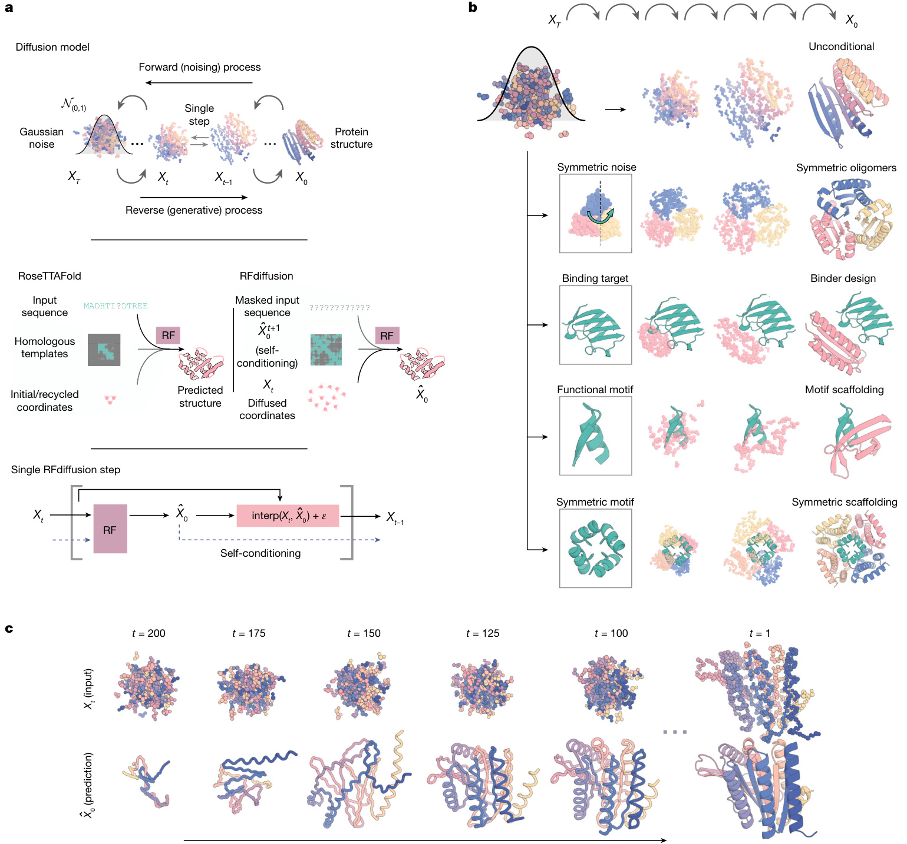
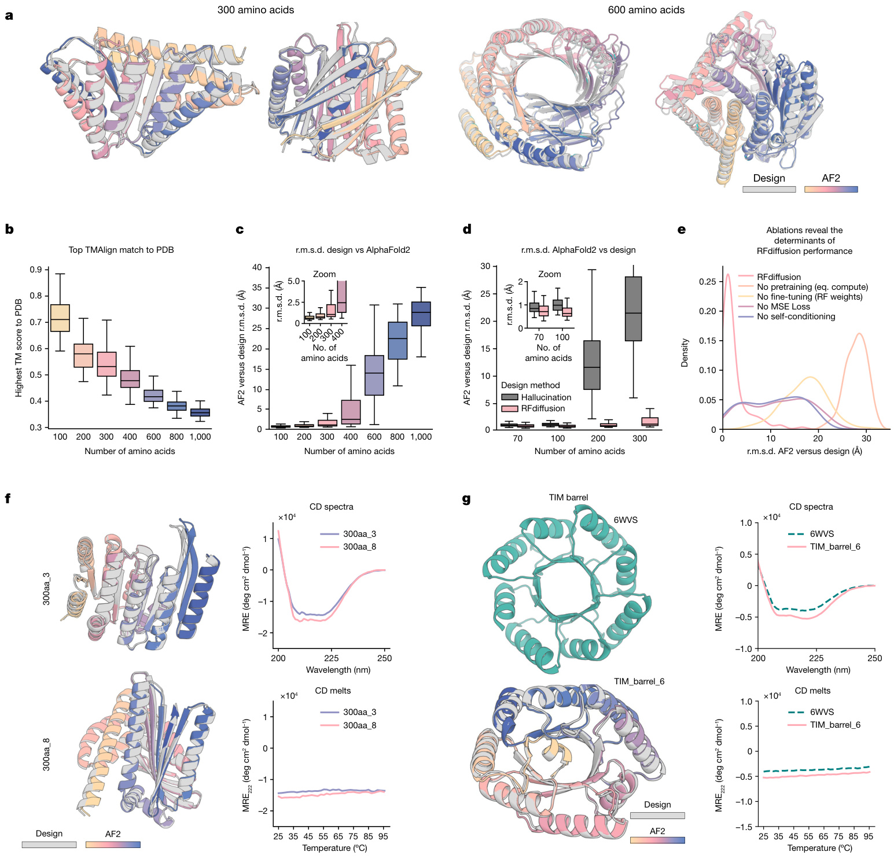
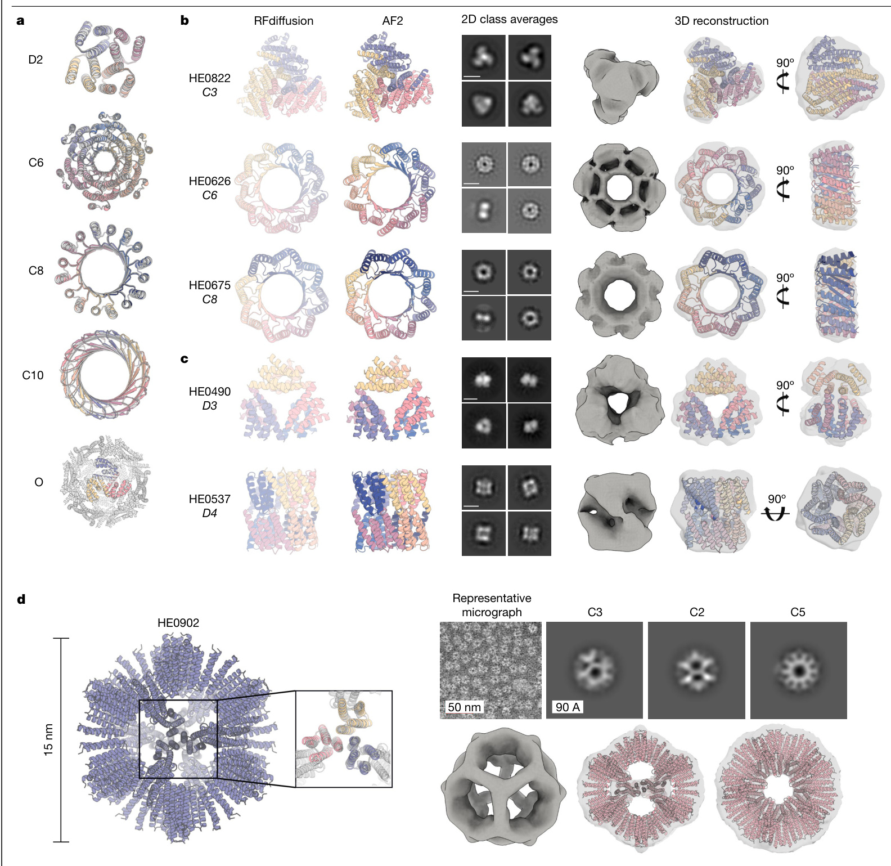
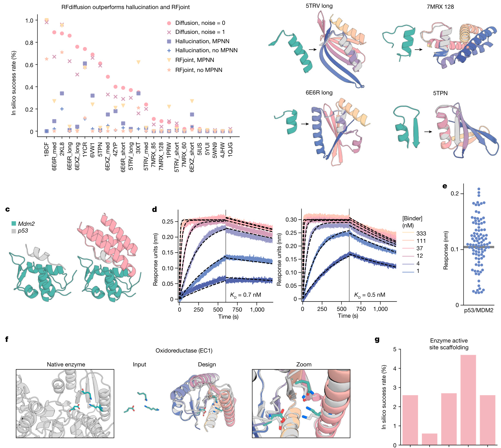
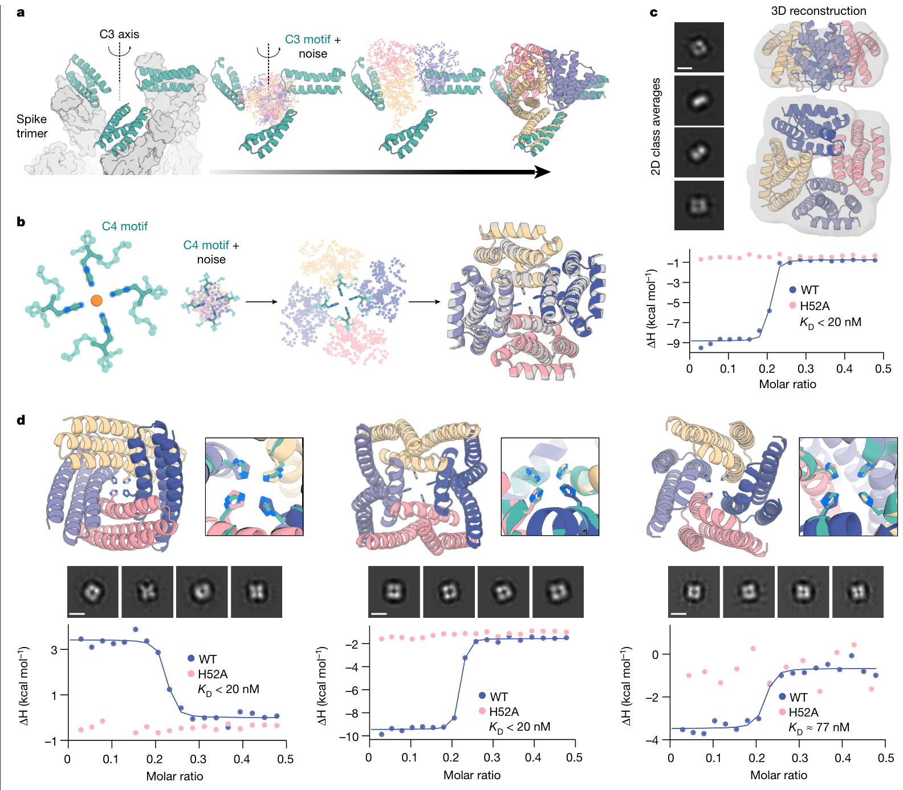
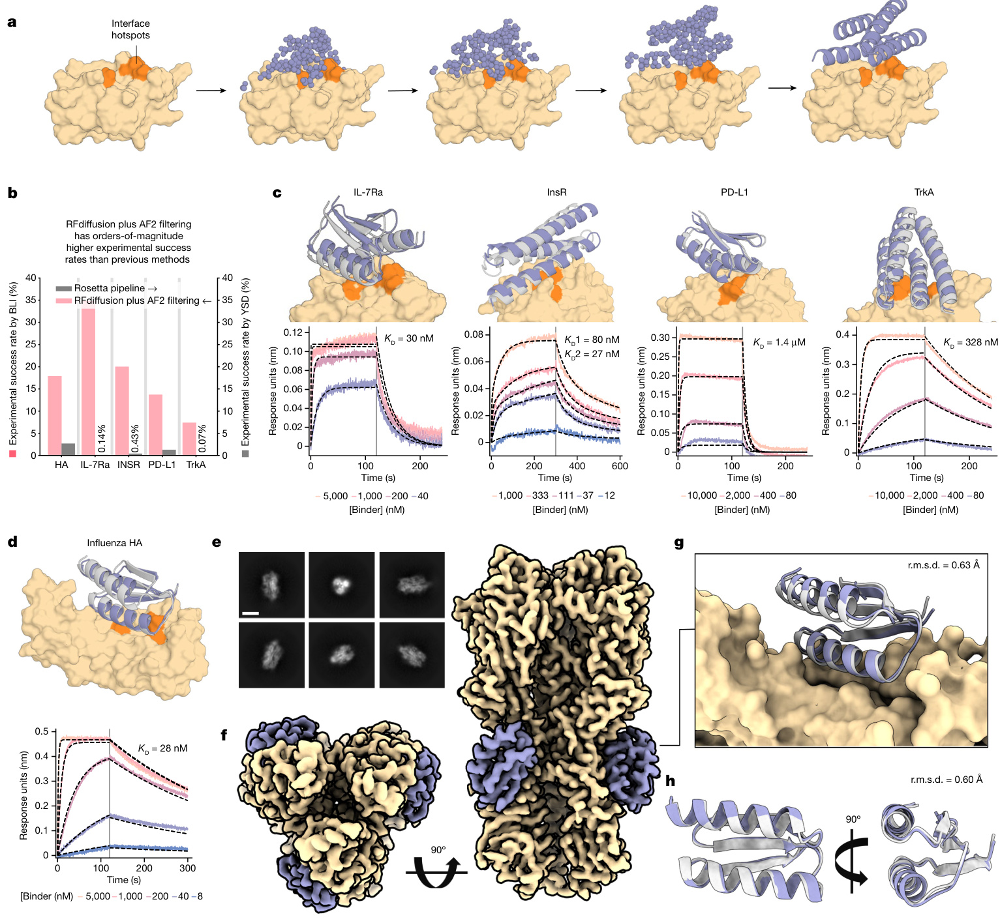

# watson-rfdiffusion-2023-gaia

Gaia knowledge package: Watson et al. 2023 -- De novo design of protein structure and function with RFdiffusion (Nature)

> **Original work:** Watson, J.L., Juergens, D., Bennett, N.R. et al. "De novo design of protein structure and function with RFdiffusion." *Nature* 620, 1089--1100 (2023). DOI: [10.1038/s41586-023-06415-8](https://doi.org/10.1038/s41586-023-06415-8)

## Summary

Watson et al. demonstrate that fine-tuning the RoseTTAFold structure prediction network as a denoising diffusion probabilistic model yields RFdiffusion, a generative method for de novo protein design that comprehensively outperforms all prior approaches. The method iteratively denoises random residue frames into realistic protein backbones, conditioned on diverse design specifications from fold topology to functional-motif coordinates to target binding sites. RFdiffusion solves 23 of 25 motif-scaffolding benchmark problems (belief 1.00), generates symmetric oligomers -- including icosahedral assemblies validated by nsEM -- with high in silico success despite never training on symmetric inputs (belief 1.00), and achieves a 19% experimental binder success rate across five therapeutic targets, roughly 100-fold over Rosetta (belief 1.00). Cryo-EM validation of the influenza binder HA_20 at 2.9 A confirms atomic-level design accuracy with 0.63 A backbone r.m.s.d. to the computational model (belief 0.87). While these results strongly support broad design success (belief 0.76), the final generality claim -- that RFdiffusion enables protein design from minimal specifications analogous to text-to-image generation -- remains only partially supported (belief 0.61), reflecting the gap between demonstrated applications and the universal promise.

## Overview

> [!TIP]
> **Reasoning graph information gain: `1.5 bits`**
>
> Total mutual information between leaf premises and exported conclusions -- measures how much the reasoning structure reduces uncertainty about the results.

```mermaid
---
config:
  flowchart:
    rankSpacing: 80
    nodeSpacing: 30
---
graph TB
    ddpm_properties_for_protein_design["DDPM properties suited for protein design\n(0.90 → 1.00)"]:::premise
    prior_ddpm_limitations["Limitations of prior protein diffusion methods\n(0.85 → 1.00)"]:::premise
    rf_inpainting_limitations["RFjoint Inpainting limitations\n(0.85 → 1.00)"]:::premise
    rfdiffusion_broad_success["★ RFdiffusion achieves broad design success\n(0.50 → 0.76)"]:::exported
    denoising_process["Iterative denoising generation process\n(0.92 → 1.00)"]:::premise
    self_conditioning_improvement["Self-conditioning improves RFdiffusion performance\n(0.88 → 1.00)"]:::premise
    pretraining_benefit["Pretraining from RF weights is critical\n(0.88 → 1.00)"]:::premise
    outperforms_hallucination["RFdiffusion outperforms RF Hallucination\n(0.92 → 1.00)"]:::premise
    symmetric_high_success["★ High in silico success for symmetric oligomers\n(0.50 → 1.00)"]:::exported
    sec_validation_oligomers["SEC validates oligomeric states\n(0.92 → 1.00)"]:::premise
    nsem_validates_cyclic["nsEM confirms cyclic oligomer structures\n(0.92 → 1.00)"]:::premise
    icosahedral_he0902["Icosahedral assembly HE0902 validated by nsEM\n(0.88 → 1.00)"]:::premise
    alt_coincidental_sec_profiles["Alternative: coincidental SEC profiles\n(0.30 → 0.30)"]:::premise
    alt_structural_mimicry_in_nsem["Alternative: structural mimicry in nsEM\n(0.12 → 0.12)"]:::premise
    alt_disordered_aggregates_mimicking_icosahedral["Alternative: disordered aggregates mimicking icosahedral symmetry\n(0.08 → 0.08)"]:::premise
    rfdiffusion_benchmark_performance["★ RFdiffusion solves 23/25 benchmark problems\n(0.50 → 1.00)"]:::exported
    hallucination_benchmark["Hallucination solves 15/25 benchmark problems\n(0.88 → 1.00)"]:::premise
    rf_inpainting_benchmark["RFjoint Inpainting solves 19/25 benchmark problems\n(0.88 → 1.00)"]:::premise
    noise_free_reverse["Noise-free reverse trajectories often improve success\n(0.88 → 1.00)"]:::premise
    motif_not_from_training["Scaffolding success independent of training set membership\n(0.88 → 1.00)"]:::premise
    p53_mdm2_design["p53-MDM2 binder scaffolding: 55/96 designs show binding\n(0.92 → 1.00)"]:::premise
    alt_nonspecific_binding_p53_mdm2["Alternative: non-specific binding in p53-MDM2 screens\n(0.18 → 0.18)"]:::premise
    alt_memorization["Alternative: training set memorization\n(0.15 → 0.15)"]:::premise
    alt_noise_free_overfitting["Alternative: noise-free improvement is overfitting\n(0.20 → 0.20)"]:::premise
    previous_binder_design_limitations["Prior binder design methods had low success rates\n(0.88 → 1.00)"]:::premise
    binder_success_rate["★ 19% binder success rate — 100× improvement over Rosetta\n(0.50 → 1.00)"]:::exported
    two_orders_attribution["Success rate improvement attributed to RFdiffusion + AF2 filtering\n(0.75 → 1.00)"]:::premise
    binder_specificity["IL-7Rα binders show site-specific binding\n(0.88 → 1.00)"]:::premise
    novel_interfaces["Novel binding interfaces distinct from PDB\n(0.88 → 1.00)"]:::premise
    ha20_cryoem_structure["Cryo-EM structure of HA_20-HA complex at 2.9 Å\n(0.95 → 1.00)"]:::premise
    ha20_atomic_accuracy["★ RFdiffusion achieves atomic-level accuracy in binder design\n(0.50 → 0.87)"]:::exported
    alt_copying_pdb_interfaces["Alternative: recapitulating PDB binding modes\n(0.15 → 0.15)"]:::premise
    alt_nonspecific_adhesion["Alternative: non-specific adhesion\n(0.18 → 0.18)"]:::premise
    alt_ha20_alternative_conformation["Alternative: HA_20 adopts alternative conformation\n(0.05 → 0.10)"]:::premise
    comprehensive_improvement["★ RFdiffusion is comprehensive improvement over prior methods\n(0.50 → 0.99)"]:::exported
    generality_claim["★ RFdiffusion enables protein design from minimal specifications\n(0.50 → 0.61)"]:::exported
    alt_outperforms_other_explanation["Alternative: benchmark artifact for unconditional generation\n(0.15 → 0.16)"]:::premise
    alt_benchmark_other_explanation["Alternative: easy benchmark set\n(0.20 → 0.21)"]:::premise
    alt_binder_other_explanation["Alternative: success due to AF2 filtering alone\n(0.25 → 0.26)"]:::premise
    strat_0(["infer\n0.03 bits"]):::weak
    alt_benchmark_other_explanation --> strat_0
    alt_binder_other_explanation --> strat_0
    alt_outperforms_other_explanation --> strat_0
    binder_success_rate --> strat_0
    outperforms_hallucination --> strat_0
    rfdiffusion_benchmark_performance --> strat_0
    strat_0 --> comprehensive_improvement
    strat_1(["infer"]):::weak
    alt_coincidental_sec_profiles --> strat_1
    alt_disordered_aggregates_mimicking_icosahedral --> strat_1
    alt_structural_mimicry_in_nsem --> strat_1
    ddpm_properties_for_protein_design --> strat_1
    denoising_process --> strat_1
    icosahedral_he0902 --> strat_1
    nsem_validates_cyclic --> strat_1
    pretraining_benefit --> strat_1
    prior_ddpm_limitations --> strat_1
    rf_inpainting_limitations --> strat_1
    sec_validation_oligomers --> strat_1
    self_conditioning_improvement --> strat_1
    strat_1 --> symmetric_high_success
    strat_2(["infer"]):::weak
    alt_copying_pdb_interfaces --> strat_2
    alt_nonspecific_adhesion --> strat_2
    binder_specificity --> strat_2
    ddpm_properties_for_protein_design --> strat_2
    denoising_process --> strat_2
    novel_interfaces --> strat_2
    pretraining_benefit --> strat_2
    previous_binder_design_limitations --> strat_2
    prior_ddpm_limitations --> strat_2
    rf_inpainting_limitations --> strat_2
    self_conditioning_improvement --> strat_2
    two_orders_attribution --> strat_2
    strat_2 --> binder_success_rate
    strat_3(["infer\n0.27 bits"]):::weak
    alt_ha20_alternative_conformation --> strat_3
    binder_success_rate --> strat_3
    ha20_cryoem_structure --> strat_3
    strat_3 --> ha20_atomic_accuracy
    strat_4(["infer"]):::weak
    alt_memorization --> strat_4
    alt_noise_free_overfitting --> strat_4
    alt_nonspecific_binding_p53_mdm2 --> strat_4
    ddpm_properties_for_protein_design --> strat_4
    denoising_process --> strat_4
    hallucination_benchmark --> strat_4
    motif_not_from_training --> strat_4
    noise_free_reverse --> strat_4
    p53_mdm2_design --> strat_4
    pretraining_benefit --> strat_4
    prior_ddpm_limitations --> strat_4
    rf_inpainting_benchmark --> strat_4
    rf_inpainting_limitations --> strat_4
    self_conditioning_improvement --> strat_4
    strat_4 --> rfdiffusion_benchmark_performance
    strat_5(["infer\n0.61 bits"]):::weak
    comprehensive_improvement --> strat_5
    ha20_atomic_accuracy --> strat_5
    strat_5 --> rfdiffusion_broad_success
    strat_6(["infer\n0.60 bits"]):::weak
    rfdiffusion_broad_success --> strat_6
    strat_6 --> generality_claim

    classDef premise fill:#ddeeff,stroke:#4488bb,color:#333
    classDef exported fill:#d4edda,stroke:#28a745,stroke-width:2px,color:#333
    classDef weak fill:#fff9c4,stroke:#f9a825,stroke-dasharray: 5 5,color:#333
    classDef contra fill:#ffebee,stroke:#c62828,color:#333
```

## Reasoning Structure

### Diffusion-Based Protein Generation: Method and Ablations

RFdiffusion's core innovation is fine-tuning the RoseTTAFold structure prediction network on protein structure denoising tasks, converting it into a generative diffusion model. The key insight (belief 1.00) is that iterative stochastic denoising from random noise overcomes both the poor backbone quality of prior DDPMs and the limited diversity of deterministic RFjoint Inpainting. Self-conditioning between timesteps (belief 1.00) and pretraining from RF weights (belief 1.00) are each shown to be essential by ablation studies. The iterative denoising process (belief 1.00) generates diverse protein backbones in as little as 11 seconds per 100-residue protein, and the full design pipeline couples RFdiffusion backbone generation with ProteinMPNN sequence design and AF2 structure prediction for validation.

### Unconditional and Fold-Conditioned Monomer Generation

RFdiffusion's unconditional generation produces diverse novel protein structures up to 600 residues (belief 0.96), spanning alpha, beta, and mixed alpha-beta topologies with little overall structural similarity to PDB training data. AF2 and ESMFold independently validate these designs, and experimental characterization of nine monomer designs confirms mixed alpha-beta CD spectra consistent with design models and extreme thermostability (belief 1.00). The statistical comparison with Hallucination is definitive: at protein lengths beyond 100 amino acids, Hallucination success rates rapidly deteriorate while RFdiffusion maintains high performance (z = 9.5, P = 1.6 x 10^-21; belief 1.00). Fold-conditioned generation further demonstrates controllability, with 42.5% in silico success for TIM barrels and 54.1% for NTF2 folds, and at least 8 of 11 experimentally tested TIM barrel designs were soluble and thermostable (belief 1.00).

### Symmetric Oligomer Design Across All Point Group Symmetries

Despite never training on symmetric inputs, RFdiffusion generates symmetric oligomers with high in silico success (belief 1.00) by leveraging the rotational equivariance inherited from RoseTTAFold. Of 608 designs tested experimentally, at least 87 showed SEC profiles consistent with designed oligomeric states within 95% confidence (belief 1.00). Negative stain EM provided direct structural confirmation: cyclic oligomers like C3 design HE0822 (1050 residues total) showed 2D class averages and 3D reconstructions matching the distinctive pinwheel design model (belief 1.00). The results extend well beyond cyclic symmetries -- dihedral (D2, D3, D4), tetrahedral, and icosahedral architectures were all validated. The crown achievement is icosahedral assembly HE0902, a 15 nm porous particle whose nsEM 3D reconstruction very closely matches the designed model, including triangular hubs arrayed around empty C5 axes (belief 1.00). Several oligomeric topologies, including expanded TIM barrel-like structures with 18 strands/helices, have no counterpart in the PDB, demonstrating exploration of structural space beyond natural evolution. Alternative explanations -- coincidental SEC profiles (belief 0.30), structural mimicry in nsEM (belief 0.12), and disordered aggregates (belief 0.08) -- collectively fail to account for the systematic multi-technique validation.

### Motif Scaffolding: Benchmark Performance and Functional Validation

The 25-problem motif-scaffolding benchmark provides the most controlled comparison: RFdiffusion solves 23 problems vs. 19 for RFjoint Inpainting and 15 for Hallucination (belief 1.00), with no hyperparameter tuning required. Noise-free reverse trajectories improve in silico success in 17 of 23 solved problems (belief 1.00), and scaffolding success is independent of training set membership (belief 1.00), ruling out memorization. Experimental validation of p53-MDM2 scaffolds shows 55 of 96 designs with detectable binding (belief 1.00), with the highest-affinity scaffolds achieving 0.5-0.7 nM dissociation constants -- three orders of magnitude tighter than the native p53 peptide (600 nM). Enzyme active site scaffolding across EC1-5 classes succeeds in silico after fine-tuning (belief 0.62), though this remains the only application area without experimental confirmation.

### Symmetric Motif Scaffolding: From Viral Binders to Metal Coordination

Symmetric motif scaffolding extends RFdiffusion to problems requiring simultaneous control of symmetry and functional-site geometry. C3-symmetric SARS-CoV-2 trimeric binders rigidly hold three copies of the ACE2 mimic AHB2 to match the spike trimer, reducing entropic cost while maintaining multivalent avidity. C4 Ni2+-binding assemblies position four histidine imidazoles in ideal square-planar coordination geometry: 18 of 36 tested designs bind nickel by ITC with dissociation constants from low nanomolar to low micromolar (belief 1.00), and H52A mutations abolish binding in all 17 tested cases (belief 1.00), confirming that metal coordination is mediated by the designed histidine site. nsEM of four Ni-binding designs shows clear fourfold symmetry matching design models (belief 1.00).

### De Novo Binder Design and Atomic-Level Structural Validation

The binder design results represent the most therapeutically relevant demonstration. RFdiffusion was fine-tuned on protein complex structures with interface hotspot conditioning, then tested against five therapeutic targets: Influenza HA, IL-7Ra, PD-L1, Insulin Receptor, and TrkA. The overall 19% experimental success rate (belief 1.00) from fewer than 100 designs per target contrasts sharply with prior Rosetta methods that required screening thousands of designs. The two-orders-of-magnitude improvement is attributed roughly one order to RFdiffusion's backbone generation and one order to AF2-based filtering (belief 1.00). Three lines of evidence confirm genuine designed interactions: competition BLI shows site-specific binding for IL-7Ra binders (belief 1.00); interfaces are often distinct from known PDB binding modes (belief 1.00); and the cryo-EM structure of HA_20 in complex with Iowa43 HA at 2.9 A resolution matches the design model at 0.63 A backbone r.m.s.d. (belief 1.00), providing the strongest single piece of structural evidence in the paper. This near-perfect agreement drives the atomic-accuracy conclusion (belief 0.87), limited mainly by the single-structure nature of the evidence.

### From Broad Design Success to the Generality Claim

The comprehensive-improvement conclusion (belief 0.99) is reached by induction across three independent application areas, each at or near belief 1.00. The more informative reasoning step is the aggregation into broad design success (belief 0.76, 0.61 bits), which requires both comprehensive improvement across applications and atomic-level structural accuracy from the cryo-EM validation. The gap between comprehensive improvement (0.99) and broad success (0.76) reflects the weight of the atomic-accuracy leg: with only a single cryo-EM structure (belief 0.87), the structural proof -- while compelling -- provides less certainty than the large-N experimental campaigns. The top-level generality claim (belief 0.61, 0.60 bits) extends the analogy to text-to-image networks, but reaches only moderate belief because the paper demonstrates success with protein-expert-designed conditioning, not truly minimal specifications accessible to non-specialists. The 0.60 bits of information gain at this final step is the highest in the entire graph, indicating precisely where the reasoning structure does the most uncertainty reduction -- and where it most honestly acknowledges the gap between what has been shown and what is claimed.

## Conclusions

| Label | Content | Prior | Belief |
|-------|---------|-------|--------|
| binder_success_rate | The overall experimental success rate for RFdiffusion binders (binding at or ... | 0.50 | 1.00 |
| comprehensive_improvement | RFdiffusion is a comprehensive improvement over current protein design method... | 0.50 | 0.99 |
| generality_claim | In a manner analogous to networks that produce images from user-specified inp... | 0.50 | 0.61 |
| ha20_atomic_accuracy | The near-perfect agreement between the cryo-EM structure and the RFdiffusion ... | 0.50 | 0.87 |
| rfdiffusion_benchmark_performance | RFdiffusion solves 23 of the 25 benchmark motif-scaffolding problems, compare... | 0.50 | 1.00 |
| rfdiffusion_broad_success | RFdiffusion achieves outstanding performance on unconditional and topology-co... | 0.50 | 0.76 |
| symmetric_high_success | Despite not being trained on symmetric inputs, RFdiffusion generates symmetri... | 0.50 | 1.00 |

## Weak Points

**Single cryo-EM structure anchors the atomic-accuracy claim.** The HA_20 binder is the only design validated at atomic resolution by cryo-EM. While the 0.63 A r.m.s.d. agreement is striking, the atomic-accuracy conclusion (belief 0.87) rests on this single structure-function demonstration. The alternative that HA_20 adopted an unrelated conformation (belief 0.10) is low but not negligible. Cryo-EM captures a single conformational snapshot of a single design, and atomic accuracy for one binder-target pair does not guarantee that the generative model consistently places backbone and sidechain atoms within experimental error across diverse targets. Additional cryo-EM or crystal structures for binders to IL-7Ra, PD-L1, or other targets would substantially strengthen the case by testing whether sub-angstrom agreement is the rule or an outlier.

**AF2 filtering confounds attribution of binder success.** The paper attributes roughly half the 100-fold binder success improvement to AF2 filtering rather than to RFdiffusion itself (belief 1.00 for the attribution claim). The alternative that success is primarily due to AF2 filtering alone (belief 0.26) is the highest-belief alternative in the binder design subgraph. The confound arises because AF2 filtering selects designs whose predicted structures closely match the generated backbone -- a criterion that could systematically enrich for designable folds regardless of generator quality. Without testing binders selected without AF2 filtering (or with a weaker filter), it is impossible to decompose the generative model's intrinsic accuracy from the post-hoc selection effect.

**Symmetric oligomer validation relies heavily on low-resolution techniques.** SEC profiles and nsEM 2D class averages provide the bulk of symmetric oligomer validation. The coincidental SEC profiles alternative retains the highest belief among oligomer alternatives (0.30) because SEC measures hydrodynamic radius, which cannot distinguish a designed ring-shaped hexamer from a non-specific globular aggregate of similar mass. Only one oligomer (D4 design HE0537) received cryo-EM characterization. Higher-resolution structural data on additional designs -- particularly the novel expanded TIM barrel-like topologies that have no natural precedent -- would close the gap between low-resolution shape agreement and true atomic-level validation of designed contacts.

**Enzyme active site scaffolding lacks experimental validation.** While in silico results show scaffolding success across EC1-5 enzyme classes after additional fine-tuning (belief 0.62), no experimental characterization of enzyme scaffolds is presented. The retroaldolase demonstration with implicit substrate modeling remains purely computational. Enzyme active sites require precise positioning of catalytic residues within sub-angstrom tolerances, and the history of computational enzyme design shows that in silico success rates often overestimate experimental outcomes. This is the weakest application area in terms of evidence depth.

## Evidence Gaps

**No experimental characterization beyond five binder targets.** The 19% binder success rate comes from five targets chosen to include therapeutically important proteins (HA, IL-7Ra, PD-L1, InsR, TrkA). Whether this rate generalizes to structurally diverse targets with unusual binding site geometries, membrane-proximal epitopes, or flexible regions is untested. The generality claim (belief 0.61) is bottlenecked precisely here.

**Missing head-to-head comparison with concurrent deep learning methods.** The paper benchmarks RFdiffusion against RF Hallucination and RFjoint Inpainting, but not against other emerging deep learning approaches to protein design (e.g., ProteinGenerator, Chroma, or Genie, which appeared around the same timeframe). The benchmark artifact alternative (belief 0.16) would be further suppressed by successful cross-method comparisons on standardized benchmarks.

**No long-term stability or in vivo functional data.** Experimental characterization is limited to in vitro biophysics (CD, SEC, BLI, ITC, nsEM, cryo-EM). None of the designs are tested for in vivo stability, immunogenicity, pharmacokinetics, or therapeutic efficacy. For the binder designs targeting therapeutic proteins, this gap between in vitro binding and clinical utility represents a significant unknown.
